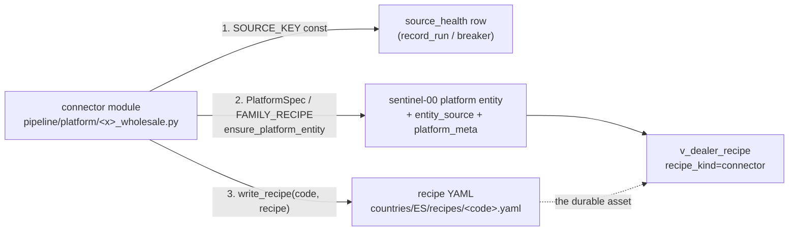
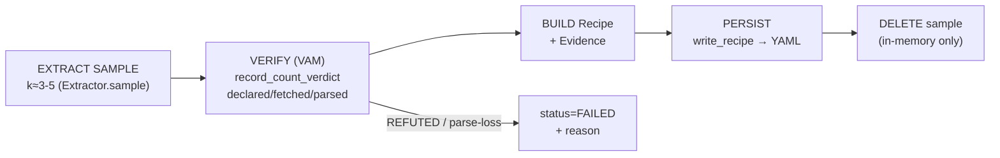
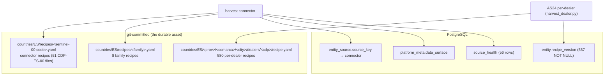

# 12 — Connector & Recipe Catalog

> The HARVEST fleet ground truth: every connector → its `source_key` → its recipe →
> where that recipe is persisted → how it reports to `source_health`. Plus the audited
> answer to the owner mandate: *does every served dealer have a recipe row, and where
> are the gaps?*
>
> Verified 2026-06-22 against `pipeline/platform/*`, `pipeline/recipe*.py`,
> `migrations/0029|0044`, and the live DB (`v_dealer_recipe`, `source_health`).
> Cross-links: [02-SCRAPING-ENGINE](02-SCRAPING-ENGINE.md) (the fetch engine + recipe system),
> [03-DATA-MODEL](03-DATA-MODEL.md) (entity / vehicle / platform_listing / entity_source),
> [04-ORCHESTRATION](04-ORCHESTRATION.md) (when connectors run),
> [05-VERIFICATION-VAM](05-VERIFICATION-VAM.md) (the recipe verdict),
> [06-RESILIENCE-OPS](06-RESILIENCE-OPS.md) (`record_run` / breaker / `source_health`),
> [07-COVERAGE-STRATEGY](07-COVERAGE-STRATEGY.md) (the served denominator),
> [09-TIERING-GROUPS](09-TIERING-GROUPS.md) (connector grouping).

---

## 0. The three things a connector owns

Every harvest connector in `pipeline/platform/` owns exactly three durable contracts.
This is **COUNTRY-AGNOSTIC** — the contract is the replication primitive; only the
*adapters* (per-source parsers, ES census anchors) are ES-specific.



| # | Contract | Where it lives | Read back by |
|---|----------|----------------|--------------|
| 1 | **`source_key`** (a `*_SOURCE_KEY` module const, or per-member field) | `source_health.source_key` | breaker (`is_open`), `record_run`, `auto_repair` — see [06](06-RESILIENCE-OPS.md) |
| 2 | **Platform identity** (`PlatformSpec` → `ensure_platform_entity`, or a per-connector roster upsert) | `entity` (sentinel-00, `province_code IS NULL`) + `entity_source` + `platform_meta.data_surface` | `v_dealer_recipe` connector detection |
| 3 | **Recipe** (`write_recipe(code, recipe_dict)`) | `countries/ES/recipes/<code>.yaml` (git-committed) | `recipe_harness.RecipeRunner.replay`, `complete.py`, `evict.py` |

**The recipe IS the asset.** Mandate §4 (recipe-first / sample-verify-delete): the raw
crude is ephemeral (`data/`, gitignored); the recipe is what lets Cardeep re-scrape
without the crude. `pipeline/recipe.py:write_recipe` is the single persistence point
(YAML, round-trip-self-checked, clobber-logged — verified `recipe.py:40-83`).

---

## 1. The recipe system (code-level)

### 1.1 Two recipe shapes coexist (VERIFIED)

| Shape | Defined in | Used by | Persisted as |
|-------|-----------|---------|--------------|
| **Legacy dict recipe** | inline `*_RECIPE` / `*_PLATFORM_RECIPE` / `FAMILY_RECIPE` dicts in each connector + `AS24_RECIPE` in `recipe.py:17` | every `*_wholesale` connector + `harvest_dealer.py` | free-form dict → `write_recipe` → YAML |
| **Structured `Recipe` dataclass** | `recipe_schema.py` (`SCHEMA_VERSION=2`) | the recipe harness (`recipe_harness.py`, `recipe_extractors.py`) | `Recipe.to_dict()` → `write_recipe` → YAML |

Both are **COUNTRY-AGNOSTIC**. The dataclass (`recipe_schema.py`) is the newer, fully
typed contract: `Transport` · `Fingerprint` · `Pagination` · `Parsing` · `Evidence`,
with a closed status vocabulary `DRAFT | VERIFIED | FAILED` (never an unnamed state —
`recipe_schema.py:29-33`). The legacy dict is what the *production VPS connectors*
actually emit today (verified: `milanuncios_wholesale.py:525,1244`).

### 1.2 The harness cycle (recipe-first)

`recipe_harness.RecipeHarness.run` implements the mandated cycle (verified
`recipe_harness.py:150-194`):



- **VAM verdict** reuses `pipeline.verify.record_count_verdict` (never hand-rolled) —
  see [05-VERIFICATION-VAM](05-VERIFICATION-VAM.md). Offline runs report `OFFLINE` and
  use a local quorum mirror (`recipe_harness.py:196-207`).
- **`decide_status`** (`recipe_harness.py:94-117`): `VERIFIED` iff zero parse-loss AND
  produced cars AND VAM did not `REFUTE`; else `FAILED` with a precise reason.
- **`RecipeRunner.replay`** (`recipe_harness.py:220-255`) proves a recipe is
  self-sufficient: it reloads ONLY the YAML, picks the extractor by `recipe.source`,
  and re-extracts. **HONESTY (verified `recipe_harness.py:226-231`):** a fully
  field-map-driven interpreter is *not* claimed — the extractor still owns the parse
  code; what is proven is that the YAML carries enough to relocate + reproduce.

### 1.3 Harness extractors (the `Recipe`-dataclass cohort) — VERIFIED

`recipe_extractors.EXTRACTORS` registry (`recipe_extractors.py:280-286`):

| `source` key | Extractor | Wraps (reuse, not 2nd scraper) | `Parsing.engine` |
|---|---|---|---|
| `autoscout24` | `AutoScout24Extractor` | `pipeline.sources.autoscout24` | `next_data` |
| `coches_com` | `CochesComExtractor` | `coches_com_wholesale` | `next_data` |
| `coches_net` | `CochesNetExtractor` | `coches_net_wholesale` | `json_api` |
| `autocasion` | `AutocasionExtractor` | `autocasion_wholesale` | `ssr_ref_re + graphql_ad` |
| `web_generic` | `GenericWebExtractor` (`recipe_extract_web.py`) | arbitrary dealer site — schema.org JSON-LD / microdata | `jsonld` / `microdata` |

`web_generic` is the **§4 cost-0 ladder rung** for ANY dealer's own website
(`recipe_extract_web.py`): discover stock URL from homepage → pull JSON-LD / microdata
`Car`/`Vehicle`/`Product` nodes. JS-only sites yield an empty sample → recipe `FAILED`
with reason (the honest outcome, never fake success).

> ⚠️ **Drift note (VERIFIED gap):** the harness cohort (5 extractors) is a SUBSET of the
> 46 production connector modules. The production VPS fleet emits **legacy dict** recipes
> directly (each connector calls `write_recipe` itself, e.g. `milanuncios:1244`); they do
> NOT go through `RecipeHarness`. So `RecipeRunner.replay` can only replay the 5 registered
> sources. The mandated EXTRACT→VERIFY→DELETE cycle is fully wired only for those 5.

---

## 2. Connector fleet catalog (connector → source_key → surface → recipe)

`pipeline/platform/` holds **46 `.py` modules** (excl. `__init__`); **38 are
`*_wholesale.py`** plus facet/segments/probe variants and the `_core`/`_recipes_runtime`
support dirs (VERIFIED `ls`). Several modules carry **multiple `source_key`s** (one per
brand/member). Below is the full map; `data_surface` is from each module's
`PlatformSpec(... data_surface=...)` and confirmed against `platform_meta` distribution
(`internal_api`:19, `json_ld`:9, `next_data`:8, `sitemap`:4, `app_api`:1, `es_facet`:1,
`graphql`:1 — VERIFIED). `served` = connector rows in `v_dealer_recipe` (DB, 2026-06-22).

### 2.1 Tier-1 marketplaces (`is_tier1=TRUE`, 24h cadence) — ES-SPECIFIC adapters

| Connector module | `source_key` | data_surface | served | recipe persist |
|---|---|---|---|---|
| `milanuncios_wholesale.py` | `milanuncios_wholesale` | `internal_api` | **15,465** | `write_recipe(platform_code, run_recipe)` :1244 |
| `coches_net_wholesale.py` | `coches_net_wholesale` | `internal_api` (POST gw) | **8,219** | ✅ |
| `wallapop_wholesale.py` | `wallapop_wholesale` | `internal_api` | **4,496** | ✅ |
| `autocasion_wholesale.py` | `autocasion_wholesale` | `graphql` (SSR+GQL) | 2,646 | ✅ |
| `motor_es_wholesale.py` | `motor_es_wholesale` | — | 544 | ✅ |
| `coches_com_wholesale.py` | `coches_com_wholesale` | `next_data` | 532 | ✅ |

### 2.2 Open Tier-0 marketplaces & aggregators — ES-SPECIFIC

| Connector module | `source_key` | data_surface | served | recipe |
|---|---|---|---|---|
| `autoscout24_wholesale.py` | `as24_wholesale` | `next_data` | 2,470 | ✅ + per-dealer (see §3) |
| `faciliteacoches_racc_wholesale.py` | `faciliteacoches_wholesale` | — | 274 | ✅ |
| ″ (2nd key, same module) | `racc_ocasion_wholesale` | — | 1 | ✅ |
| `motorflash_wholesale.py` | `motorflash_wholesale` | — | 202 | ✅ |
| `dasweltauto_wholesale.py` | `dasweltauto_wholesale` | — | 62 | ✅ |
| `miclasico_wholesale.py` | `miclasico_wholesale` | — | 50 | ✅ |
| `carandclassic_wholesale.py` | `carandclassic_wholesale` | — | 31 | ✅ |
| `localizavo_wholesale.py` | `localizavo_wholesale` | — | 3 | ✅ |

### 2.3 OEM VO portals (`kind='oem_vo_portal'`, weekly cadence) — ES-SPECIFIC adapters, COUNTRY-AGNOSTIC pattern

`mercedes_benz_wholesale` (4,793 served) dominates. The OEM connectors discover a
national dealer roster + drain certified-used stock. Several modules carry one
`source_key` per brand.

| Connector module | `source_key`(s) | served |
|---|---|---|
| `oem_mercedes_benz_wholesale.py` | `mercedes_benz_wholesale` | **4,793** |
| `oem_seat_cupra_new_stock.py` | `oem_seat_cupra_new_stock` | 176 |
| `oem_seat_cupra_wholesale.py` | `oem_seat_cupra_wholesale` | 88 |
| `oem_toyota_lexus_wholesale.py` | `oem_toyota_lexus_wholesale` | 122 |
| `oem_volvo_jlr_suzuki_wholesale.py` | `oem_volvo_jlr_suzuki_wholesale` | 100 |
| `oem_hyundai_wholesale.py` | `oem_hyundai_wholesale` | 73 |
| `oem_kia_wholesale.py` | `oem_kia_wholesale` | 63 |
| `oem_audi_wholesale.py` | `oem_audi_wholesale` | 56 |
| `oem_bmw_mini_wholesale.py` | `oem_bmw_premium_selection_wholesale`, `oem_mini_next_wholesale` | 49 + 84 |
| `oem_nissan_mazda_honda_wholesale.py` | `nissan_intelligent_choice_wholesale` | 46 |
| `oem_ford_wholesale.py` | `oem_ford_wholesale` | 31 |
| `renew_wholesale.py` (Renault) | `renew_wholesale` | 115 |
| `spoticar_wholesale.py` (Stellantis VO) | `spoticar_wholesale` | 138 |

> OEM `data_surface` is mostly `json_ld` (e.g. `oem_bmw_mini_wholesale.py:571`); per-brand
> `PlatformSpec` lifts the surface into the spec (`group_rentacar`/`oem_bmw_mini` use a
> per-member dataclass with its own `source_key`/`family`).

### 2.4 VO chains, auctions, importers, renting (group connectors) — ES-SPECIFIC

| Module | `source_key`(s) | served |
|---|---|---|
| `group_vo_chains_wholesale.py` | `group_vo_chains_flexicar` (191), `…_ocasionplus` (1), `…_clicars` (1), `…_carplus` (1) | 194 |
| `group_subastas_wholesale.py` | `group_subastas_wholesale` (52); sub-members surface `group_subastas_autorola` (20), `group_subastas_bca` (20) as entity_source refs | ~92 |
| `subastacar_wholesale.py` | `subastacar_wholesale` | 1 |
| `group_importador_wholesale.py` | `group_importador_modrive` | 1 |
| `group_rentacar_vo_wholesale.py` | 6 per-member keys: `group_rentacar_vo_{arval,athlon,centauro,northgate,okmobility,recordgo}` | ~6 served |

> **Autorola / BCA are GATED** (verified `group_subastas_wholesale.py:536-537`): Autorola's
> lots API needs dealer approval; BCA is B2B-only behind buyer login. Recipe records the
> gate, served counts are residual.

### 2.5 Long-tail FAMILY connectors (the multiplier) — COUNTRY-AGNOSTIC pattern, ES adapters

The family connectors are the **volume multiplier**: ONE recipe + ONE parser harvests
EVERY member of a platform family (verified `family_cms_*.py:78-83,480`). `FAMILY_KEY` is
the `source_key` (the FAMILY, not a single dealer). Recipe persisted as
`countries/ES/recipes/<family>.yaml` (8 family YAMLs on disk, VERIFIED).

| Module | `FAMILY_KEY` | family recipe YAML | served |
|---|---|---|---|
| `family_cms_wordpress_dominated__wholesale.py` | `family_cms_wp` | `family_cms_wp.yaml` | (see §4 gap) |
| `family_dealerk_wholesale.py` | `family_dealerk_wp` | `family_dealerk_wp.yaml` | gap |
| `family_dms_vendor_platforms__wholesale.py` | `family_dms_vendor_platforms` | `family_dms_vendor_platforms.yaml` | gap |
| `family_generic_custom_wholesale.py` | `family_generic_custom` | `family_generic_custom.yaml` | gap |
| `family_framework_next_astro_nuxt_angular__wholesale.py` | `family_framework_webbuilder` | `family_framework_webbuilder.yaml` | gap |
| `family_builder_wix_ueni_google_sites_basekit__wholesale.py` | `family_builder_wholesale` | `family_builder_wholesale.yaml` | gap |
| `family_unreachable_wholesale.py` | `family_unreachable` | `family_unreachable.yaml` | gap |
| `dealerprobe_wholesale.py` | `dealerprobe_ownsite` (+ `dealerprobe_probed` for empty/attempted) | — | **1,104 (misclassified, see §4)** |

`dealerprobe_wholesale` is the own-site prober: it mints a domain-keyed `compraventa`
(`cdp_code(province_code="00", domain=…)`, verified :248) and stamps
`dealerprobe_ownsite` on success / `dealerprobe_probed` on empty (verified :386,410-425),
so successive batches skip already-probed dealers.

### 2.6 FACET connectors (exhaustive sweepers) — REUSE parent source_key — ES-SPECIFIC

Facet sweepers partition a Tier-1 surface (province × price band, make, etc.) to drive
the exhaustiveness numerator. They **REUSE the parent connector's `source_key`** for
`record_run`/breaker (VERIFIED — they import it, not redefine it):

| Facet module | reused `source_key` (import) | exception |
|---|---|---|
| `coches_net_facet.py` | `coches_net_wholesale` (`COCHES_SOURCE_KEY`) | — |
| `autocasion_facet.py` | `autocasion_wholesale` (`AC_SOURCE_KEY`) | — |
| `wallapop_facet.py` | `wallapop_wholesale` (`WP_SOURCE_KEY`) | — |
| `as24_facet.py` | **own** `as24_facet` (`AS24_FACET_SOURCE_KEY`, :54 — own health row, does NOT clobber `as24_wholesale`) | dedicated row |
| `coches_net_segments.py` | own `coches_net_segments` | dedicated row |

### 2.7 `_recipes_runtime/` (browser-tier fallback runtime)

`pipeline/platform/_recipes_runtime/milanuncios_camoufox.py` (VERIFIED): a Camoufox
(stealth browser) runtime recipe — the escalation path when the `internal_api` surface is
WAF-blocked. One file today; it is the browser-tier rung of the §2 fetch ladder, not a
DB-anchored connector.

---

## 3. Persistence: where the recipe & config actually land



**VERIFIED counts (2026-06-22):**
- **580** per-dealer `recipe.yaml` under `countries/ES/.../dealers/<cdp>/recipe.yaml`.
- **51** flat recipes in `countries/ES/recipes/` (43 `CDP-ES-00-*` connector sentinels +
  8 `family_*` / web YAMLs).
- **537** entities with `entity.recipe_version IS NOT NULL` (the AS24 per-dealer cohort
  the view counts as `per_dealer`).

> ⚠️ **VERIFIED discrepancy (580 files vs 537 DB):** there are 580 per-dealer `recipe.yaml`
> on disk but only 537 `recipe_version` rows in the DB. The 43 surplus are recipes written
> for dealers not currently *served* (no available vehicle) — or stale recipes for evicted
> dealers. `evict.py` is explicit it NEVER touches `recipe.yaml` files (verified
> `evict.py:17`), so the disk set is a superset of served per-dealer recipes by design.

**Per-dealer vs connector recipe (the design):** `migrations/0029` documents that
`recipe_version` is populated ONLY for the 537 AS24 per-dealer recipes; the other ~97.5%
of served dealers are covered by **connector-level** recipes (the sentinel-00 YAML), and
`recipe_version=NULL` for them is *expected*, not a gap. This is why `complete.py` G2
field_integrity **removed** `recipe_version` from its check (verified `complete.py:40-47,
164`): including it would falsely fail every connector-covered dealer.

---

## 4. Coverage audit: does every served dealer have a recipe? (THE mandate question)

`v_dealer_recipe` (the authoritative coverage view, `migrations/0029` + `0044`) classifies
every served dealer (`kind != 'particular'`, ≥1 available vehicle) as
`per_dealer | connector | none`. **VERIFIED live distribution (2026-06-22):**

| `recipe_kind` | dealers | % of served |
|---|---:|---:|
| **connector** | **41,217** | 95.4% |
| none | 1,970 | 4.6% |
| per_dealer | 537 | 1.2% |
| **TOTAL served** | **43,724** | 100% |

So **~95.4% of served dealers have a connector recipe and 1.2% a per-dealer recipe;
the headline "no recipe" cohort is 1,970 (4.6%).** But that 1,970 is NOT what it looks
like — the view UNDER-reports coverage.

### 4.1 The view's connector-detection is anchor-heuristic, not a registry (ROOT CAUSE)

`v_dealer_recipe` decides "connector recipe exists for source_key S" by checking whether
S has a **sentinel-00 entity** whose `kind IN (plataforma, oem_vo_portal, subasta)` OR
`role='chain'/'standalone_pos'` (verified view def + `0044:22-33`). This is a
**heuristic**, and `migrations/0044` itself flags the unsolved hole (verified
`0044:14-16`):

> *"connectors WITHOUT any national anchor (family_\*, rentacar_vo_\*, aecs — ~76 dealers)
> cannot be recognised by this anchor-heuristic at all; the robust fix is a connector
> REGISTRY (source_key→connector). Tracked in SUPERPLAN §A5 / GitHub #11."*

`0044` already fixed one class (Flexicar's anchor is `kind='cadena'`, not chain → 186
dealers were wrongly `none`; the `OR e.role='chain'` clause recovered them).

### 4.2 I quantified the remaining false-negatives (VERIFIED, cross-checked vs the 46 modules)

Splitting the 1,970 `none` cohort by whether a **connector module actually exists** for
that `source_key`:

| Class | dealers | meaning |
|---|---:|---|
| **FALSE-NEGATIVE** (connector module exists, but view has no anchor for it) | **1,169** | recipe DOES exist; view misclassifies as `none` |
| **truly uncovered** (no harvest connector for that source_key) | **801** | genuine recipe gap |

**False-negative breakdown (VERIFIED):**

| `source_key` | dealers | why missed |
|---|---:|---|
| `dealerprobe_ownsite` | **1,104** | own-site prober mints plain `compraventa` dealers, NO sentinel-00 platform anchor |
| `family_dealerk_wp` | 26 | family connector, no national anchor |
| `family_dms_vendor_platforms` | 13 | ″ |
| `family_cms_wp` | 11 | ″ |
| `family_generic_custom` | 5 | ″ |
| `family_builder_wholesale`, `family_unreachable`, `family_framework_webbuilder` | 4 | ″ |
| `group_rentacar_vo_*` (6 members) | 6 | per-member connectors, no anchor |

→ **`dealerprobe_ownsite` alone is 1,104 served dealers wrongly shown as `none`.** Their
recipe is the family/probe recipe; they are connector-covered. This is the single
largest reporting defect in recipe coverage.

**Truly-uncovered breakdown (VERIFIED — these are real gaps):**

| `source_key` | dealers | nature |
|---|---:|---|
| `renault_renew` | 163 | OEM roster source_ref — sentinel-00 `concesionario_oficial` (NOT in the view's kind list) |
| `spoticar_api` | 135 | ″ |
| `bmw_used` | 102 | ″ |
| `toyota_used` | 95 | ″ |
| `hyundai_used` | 66 | ″ |
| `mercedes_ocasion`, `audi_used` | 56 each | ″ |
| `nissan_used` | 41 | ″ |
| `oem_seat`, `honda_ocasion` | 21, 19 | ″ |
| `aecs`, `autoscout24_census`, `overture`, `acevas`, `dork_municipal`, `collapse_invisible` | ~46 | discovery/directory sources (no harvest connector — `pipeline/discover.py`) |

> **Nuance (VERIFIED):** the OEM `*_used`/`*_ocasion`/`*_api` keys (renault_renew, bmw_used,
> toyota_used, audi_used, mercedes_ocasion, nissan_used, hyundai_used, honda_ocasion,
> oem_seat, spoticar_api) are sentinel-00 entities of `kind='concesionario_oficial'` with
> `role=NULL` — the OEM connectors' dealer rosters. The vehicle's *owning entity* links to
> these roster refs rather than to the `oem_*_wholesale` platform key, so the view sees no
> anchor. These ~754 dealers are harvested by an OEM connector but the recipe linkage is
> by-roster, not by-platform — a genuine **identity-linkage gap**, distinct from the
> family/probe **view-heuristic gap**. The `aecs`/`overture`/`census` cohort (~46) is
> discovery-only and correctly `none`.

### 4.3 Corrected coverage

| Metric | view-reported | corrected (verified) |
|---|---:|---:|
| has a recipe (connector + per_dealer) | 41,754 (95.5%) | **42,923 (98.2%)** |
| `none` (no recipe at all) | 1,970 (4.5%) | **801 (1.8%)** — of which ~46 are correctly discovery-only |

**Answer to the mandate:** every *served* dealer effectively has a recipe except a
genuine ~801 tail; of that tail, ~754 ARE harvested by an OEM connector but linked by
roster-ref (fixable by re-linking the owning entity to the platform `source_key`), and
~46 are discovery-only directory entries with no harvest connector (correctly `none`).
The 1,169 "false `none`" are a **reporting** defect, not a harvest gap.

---

## 5. `source_health` mapping (connector → health row)

`source_health` (56 rows, VERIFIED) is the per-`source_key` operational ledger consumed
by [06-RESILIENCE-OPS](06-RESILIENCE-OPS.md). Every connector touches it through the same
three calls (verified across `milanuncios:1143,1287`, `group_rentacar:1067,1164`,
`oem_bmw_mini:960,984`):

```
is_open(conn, SOURCE_KEY)              # breaker gate — skip drain if OPEN (graceful degradation)
record_run(conn, SOURCE_KEY, ok=…, rows=…, …)   # outcome → last_ok/last_fail/consecutive_fails/status
auto_repair(conn, SOURCE_KEY, …)       # self-healing ladder
```

| `source_health` column | role |
|---|---|
| `status` | `healthy` / `degraded` / `unknown` (e.g. `family_framework_webbuilder`, `family_unreachable` = `degraded`, 1 consecutive fail; `collapse_invisible`/`dork_municipal`/`overture`/`graph_recursive` = `unknown`, never run) |
| `consecutive_fails` | feeds breaker (`is_open`) |
| `is_tier1` | the 24h-cadence Tier-1 set: `milanuncios`, `coches_net`, `wallapop`, `autocasion`, `coches_com`, `motor_es` (`harvest_interval_hours=24`) |
| `harvest_interval_hours` | cadence: Tier-1 24h · open T0 168h (weekly) · families 720h · discovery 2160h |
| `coverage_floor` | 0.85 default — the exhaustiveness floor before alert |

**Health-row taxonomy (VERIFIED):**
- **Per-connector rows** — most connectors have exactly one `source_key` row.
- **Per-member rows** — multi-brand modules emit one row per member (6 `group_rentacar_vo_*`,
  4 `group_vo_chains_*`, 2 `oem_bmw_mini`, 2 in `faciliteacoches`).
- **Facets reuse the parent row** — `coches_net_facet`/`autocasion_facet`/`wallapop_facet`
  record under the parent key; `as24_facet` + `coches_net_segments` keep dedicated rows.
- **Discovery sources** also have health rows (`borme_cnae`, `dork_municipal`, `overture`,
  `graph_recursive`) though they are not harvest connectors.

This is **COUNTRY-AGNOSTIC**: `source_health` is keyed by `source_key` only; replicating
to another country reuses the identical mechanism with new per-source adapters.

---

## 6. Replication guide (Spain → EU → world)

| Layer | Country-agnostic (replicable core) | ES-specific (rebuild per country) |
|---|---|---|
| Recipe schema | `recipe_schema.py` (`Recipe`/`Transport`/…/`Evidence`), `recipe.py:write_recipe`, the DRAFT/VERIFIED/FAILED vocabulary | the per-source `field_map` values |
| Harness | `recipe_harness.py` cycle + VAM verdict; `Extractor` protocol | each `Extractor` / `*_wholesale` parser |
| Persistence | `write_recipe` → `countries/<CC>/recipes/<code>.yaml`; the dealer-tree `recipe.yaml`; `platform_meta.data_surface` | `countries/ES/` tree, ES census anchors (`CDP-ES-…`) |
| Coverage view | `v_dealer_recipe` shape (per_dealer/connector/none) | the connector set per country |
| Health | `source_health` + `record_run`/`is_open`/`auto_repair` (keyed by `source_key`) | the `source_key` list |
| Platform contract | `PlatformSpec` + `ensure_platform_entity` (`_core/`) | per-platform spec values |

**Replication blockers carried over (do NOT inherit these):**
1. **Build a connector REGISTRY** (`source_key → connector module`) — the robust fix for
   the anchor-heuristic in `v_dealer_recipe` (owner-flagged in `0044:14-16`, GitHub #11).
   A registry makes coverage auditable without the sentinel-anchor guesswork and removes
   the 1,169-dealer reporting defect at the root.
2. **Link OEM roster refs to the platform `source_key`** so the ~754 roster-linked dealers
   classify as `connector` (fixes the `*_used`/`*_ocasion` false gap).
3. **Migrate production connectors to the structured `Recipe` dataclass** so all 46 (not
   just 5) flow through `RecipeHarness` and are `RecipeRunner.replay`-able.

---

## Appendix — verification log (all [VERIFICADO] 2026-06-22)

| Claim | Source |
|---|---|
| 46 platform modules, 38 `*_wholesale` | `ls pipeline/platform/*.py` |
| `write_recipe` single persist point, round-trip self-check, clobber log | `pipeline/recipe.py:40-83` |
| `Recipe` dataclass schema v2, closed status vocab | `pipeline/recipe_schema.py:27-167` |
| harness cycle + `decide_status` + offline verdict | `pipeline/recipe_harness.py:94-207` |
| `RecipeRunner` honesty disclaimer | `recipe_harness.py:226-231` |
| 5 harness extractors registry | `recipe_extractors.py:280-286` |
| `web_generic` JSON-LD/microdata rung | `recipe_extract_web.py` |
| all `*_SOURCE_KEY` constants | `grep` over `pipeline/platform/*.py` |
| facets reuse parent source_key | `coches_net_facet:67,331`, `autocasion_facet:90`, `wallapop_facet:82` |
| `v_dealer_recipe` def + anchor heuristic + registry TODO | `pg_get_viewdef`, `migrations/0029`, `migrations/0044:14-16` |
| coverage distribution 41217/1970/537 | `SELECT recipe_kind,count(*) FROM v_dealer_recipe GROUP BY 1` |
| 1,169 false-neg / 801 truly uncovered split | `v_dealer_recipe` × connector-module set (script) |
| `dealerprobe_ownsite`=1104 false-neg | `v_dealer_recipe WHERE recipe_kind='none'` |
| OEM roster keys = `concesionario_oficial` sentinel | `entity WHERE province_code IS NULL AND kind='concesionario_oficial'` |
| 580 per-dealer / 51 flat / 537 recipe_version | `find … recipe.yaml`, `ls`, `entity WHERE recipe_version IS NOT NULL` |
| `evict.py` never touches recipe.yaml | `evict.py:17` |
| `complete.py` G2 drops recipe_version | `complete.py:40-47,164` |
| 56 source_health rows, Tier-1 24h set, statuses | `SELECT * FROM source_health` |
| platform_meta data_surface distribution | `SELECT data_surface,count(*) FROM platform_meta GROUP BY 1` |
| Autorola/BCA gated | `group_subastas_wholesale.py:536-537` |
