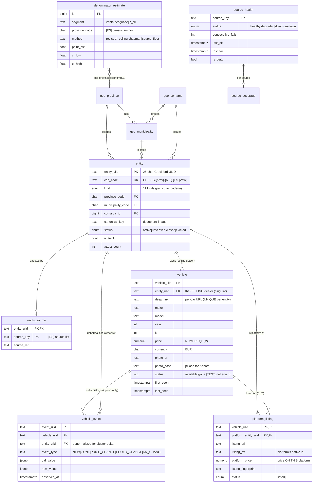
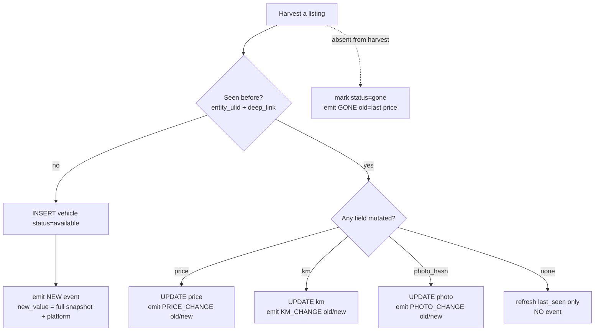
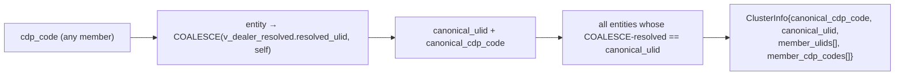

# CARDEEP — 13 · The Live API, the Served Data Model & the Delta Engine

> **As-built contract document.** This is the *current, running* shape of the
> served surface: the exact PostgreSQL tables the API reads, the views it reads
> *through*, every HTTP endpoint it exposes, and how the **delta** (altas/bajas /
> Δprice / Δkm / Δphoto / full history) is represented in the database and served
> to callers.
>
> **Relationship to [03-DATA-MODEL](03-DATA-MODEL.md):** doc 03 is the *design
> pillar* — the full schema contract the migration runner converges to (it is
> pinned to the early counts: 12.862 entities / 39.068 vehicles / 41.165 events,
> migrations 0001–0012). **This doc 13 is the as-built API+delta layer verified
> against the live DB and the live router code** (migrations through 0050). Where
> 03 and the running system diverge, **the running system wins and the divergence
> is flagged here.** Read 03 for the *why* of the schema; read 13 for *what the
> API actually serves today and how the delta works*.
>
> **Marking discipline.** Every load-bearing claim is `[VERIFICADO]` (read from a
> repo file or a query I ran this session) or `[ASUMIDO]` (inferred). No invented
> paths/tables/fields/behaviour.
>
> **Replication tag.** Every block is tagged **[CORE]** (country-agnostic —
> replicable to any country as-is) or **[ES]** (Spain-specific — census anchors,
> per-source adapters, `CDP-ES-` prefix). The data model and delta engine are
> **[CORE]**; only the source list, the `ES` code prefix, and the census
> denominators are **[ES]**.

---

## 0. Ground truth this document is pinned to

Verified this session against the running DB (`postgres://cardeep@localhost:5433/cardeep`)
and the router source in `services/api/`.

| Fact | Value | Evidence |
|---|---|---|
| Engine | PostgreSQL 16 (Docker `cardeep-pg`, `127.0.0.1:5433`) | `[VERIFICADO]` `docker-compose.yml`, live `\dt` |
| Web framework | FastAPI + asyncpg pool (`min 1 / max 8`) | `[VERIFICADO]` `services/api/main.py:86` |
| Run command | `uvicorn services.api.main:app --host 127.0.0.1 --port 8090` | `[VERIFICADO]` `main.py:6` |
| API envelope | `{ok, data, error, meta}` on **every** response (incl. 4xx/429) | `[VERIFICADO]` `services/api/deps.py:38-43` |
| App version | `Cardeep API 0.2.0` | `[VERIFICADO]` `main.py:93` |
| Live route count | **18 GET routes** across 5 routers (`ops, entities, geo, vehicles, platforms`) | `[VERIFICADO]` grep of `@router.get`, `main.py:125-129` |
| Live entities | **419.563** | `[VERIFICADO]` `SELECT count(*) FROM entity` |
| Live vehicles | **2.291.776** (available 2.261.493 · gone 30.283) | `[VERIFICADO]` `SELECT count(*) FROM vehicle` |
| Live vehicle_event rows | **2.499.440** (the delta history) | `[VERIFICADO]` `SELECT count(*) FROM vehicle_event` |
| Live platform_listing edges | **2.091.082** | `[VERIFICADO]` `SELECT count(*) FROM platform_listing` |
| Event types in use | NEW 2.292.773 · PRICE_CHANGE 113.480 · PHOTO_CHANGE 49.473 · GONE 34.402 · KM_CHANGE 9.312 | `[VERIFICADO]` `GROUP BY event_type` |
| `/stats` dealers (live) | **58.155** (`v_dealer_resolved`, `kind<>'particular'`) | `[VERIFICADO]` ran the `/stats` query directly |
| `/stats` unique-available cars | **1.926.015** (canonical-only + available) | `[VERIFICADO]` ran the `/stats` query directly |

> **Doc-drift flagged:** doc 03's headline ("12.862 entities, 39.068 vehicles")
> is the 2026-06-12 snapshot, **two orders of magnitude below today's live DB**.
> The `/stats` docstring (`ops.py:60`) also names a stale `40 016 → ~40 194`
> dealer figure; the live `/stats` query now returns **58.155** because it
> includes more kinds than just curated dealers (see §6.2). These are
> documentation-pin drifts, **not** code bugs — the *queries* are correct; only
> the comments quote old numbers.

---

## 1. The served data model (ER)

The API never serves a hand-rolled object graph — it serves a thin projection of
seven base tables, read **through three "servable" views** that enforce the
publish gate. **[CORE]** for the whole shape; **[ES]** only where noted.



### 1.1 The seven base tables the API touches

| Table | Cols | Role | Migration | Tag |
|---|---|---|---|---|
| `entity` | 38 | point-of-sale / platform / private seller graph | `0002` (+`0006` evolve) | [CORE] schema, [ES] `cdp_code` prefix |
| `vehicle` | 19 | inventory snapshot (one row per listing-URL) | `0003` | [CORE] |
| `vehicle_event` | 7 | **append-only delta history** | `0003` | [CORE] |
| `platform_listing` | (edge) | car ↔ platform dual-membership (0..M) | `0009` | [CORE] |
| `entity_source` | 4 | multi-source provenance (capture-recapture) | `0002` | [CORE], [ES] source keys |
| `source_health` | 6 | per-source watchdog (feeds `/sources`) | `0004` (+`0024`) | [CORE], [ES] source keys |
| `alert` | 7 | exact-origin alerts (feeds `/alerts`) | `0004` | [CORE] |
| `denominator_estimate` | 13 | per-province census ceiling / MSE estimate | `0026`/`0042`/`0048` | [ES] anchors, [CORE] method |
| `source_coverage` | 8 | post-harvest "how much of X do we have" | `0024` | [CORE], [ES] source keys |

`[VERIFICADO]` column counts from `information_schema.columns`; migration numbers
from `migrations/`.

> **Schema note (kind evolution):** `0002_entities.sql` created `entity.kind` as a
> `CHECK` over 6 string values; `0006_entity_evolve.sql` + `0017_particular_kind.sql`
> converted it to a real enum and added kinds. Live enum is **11 kinds**
> `[VERIFICADO]` (`particular` 339.800, `compraventa` 66.549, `garaje` 7.900,
> `desguace` 2.785, `concesionario_oficial` 2.299, `subasta` 177, `plataforma` 18,
> `oem_vo_portal` 14, `importador` 11, `rent_a_car_vo` 6, `cadena` 4). See
> [01-ENTITY-ONTOLOGY](01-ENTITY-ONTOLOGY.md) for the kind boundaries. **[ES]**
> kind population mix is Spain's market; the enum itself is **[CORE]**.

### 1.2 The three "servable" views — the publish gate

The API **must not read raw `entity`/`vehicle`** for live inventory. It reads
through views that mechanically drop anything that must not be served. This is the
0031 publish-gate invariant ("the API reads through these views, never the raw
tables … the instant a quarantining item opens, the subject vanishes from every
served surface — mechanically, not by promise"). **[CORE]**

| View | Built on | Drops | Migration |
|---|---|---|---|
| `servable_vehicle` | `vehicle` | `status<>'available'` **AND** `price<=0` **AND** open-quarantine | `0045` (over `0040`) |
| `servable_entity` | `entity` (37 cols) | `status IN ('evicted','closed')` **AND** open-quarantine | `0046` (over `0031`) |
| `v_canonical_vehicle` | `vehicle_cluster` | rows not in the latest **`vam_verified=TRUE`** cluster run | `0023` |
| `v_dealer_resolved` | `entity` + `canonical_dedup` | — (resolution map: entity → super-canonical) | `0028` |

`[VERIFICADO]` definitions read in `migrations/0045`, `0046`, `0023`, `0028`; all
seven views present live (`v_canonical`, `v_canonical_vehicle`, `v_dealer_resolved`,
`servable_entity`, `servable_vehicle`, `v_province_seal`, `v_exhaustiveness_seal`).

> **Live counts (this session):** `servable_vehicle` = 2.261.442 (≈ available
> total minus zero-price/quarantine), `servable_entity` = 419.563 (0 evicted /
> 0 closed today), `v_canonical_vehicle` = 2.262.673. `[VERIFICADO]`

**Identity resolution** (cluster collapse of cross-dealer + cross-platform
duplicates) is documented in depth in
[11-IDENTITY-RESOLUTION-AUTHORITY](11-IDENTITY-RESOLUTION-AUTHORITY.md). The API
consumes its **output views** (`v_dealer_resolved`, `v_canonical_vehicle`) via the
`resolve_cluster` helper (§4).

---

## 2. The DELTA model — how change is represented

The mandate is "an inventory in a functional API with altas/bajas/Δprice/Δkm/Δphoto
and history". The delta is **not** computed at read time — it is **materialized at
ingest time** into the append-only `vehicle_event` table. **[CORE]** in full; the
delta engine is country-agnostic.

### 2.1 The five event types (what each delta IS)

`vehicle_event.event_type` is constrained to exactly these five
(`0003_vehicles_events.sql:38`) `[VERIFICADO]`:

| `event_type` | Meaning (mandate term) | `old_value` (JSONB) | `new_value` (JSONB) | Live count |
|---|---|---|---|---|
| `NEW` | **alta** — first time this car is seen | `NULL` | full snapshot incl. provenance | 2.292.773 |
| `GONE` | **baja** — car removed/sold | last `{price}` | `NULL` | 34.402 |
| `PRICE_CHANGE` | **Δprice** | `{price: old}` | `{price: new}` | 113.480 |
| `KM_CHANGE` | **Δkm** | `{km: old}` | `{km: new}` | 9.312 |
| `PHOTO_CHANGE` | **Δphoto** (perceptual-hash diff) | `{photo: old_url}` | `{photo: new_url}` | 49.473 |

`[VERIFICADO]` counts from `GROUP BY event_type`; sample payloads pulled live:

```jsonc
// NEW  (one alta — carries source provenance)
old_value: null
new_value: {"price":10000.0,"title":"Dacia Sandero Stepway","version":"0.9 TCe 90 Stepway 5p",
            "platform":"wallapop","seller_type":"private"}

// PRICE_CHANGE  (pure Δ — only the mutated field)
old_value: {"price":36090.0}   new_value: {"price":35817.0}

// GONE  (baja — new is null)
old_value: {"price":20250.0}   new_value: null

// PHOTO_CHANGE
old_value: {"photo":".../31d5def4-...webp"}  new_value: {"photo":".../56e59f27-...webp"}

// KM_CHANGE
old_value: {"km":65023}   new_value: {"km":66780}
```

### 2.2 Provenance / source attribution — precise field semantics

> **Correction to the task brief.** The brief referenced `new_value->>'source'`
> as the source key. **Verified live, that is NOT where the platform/source lives
> for the bulk of events.** On `NEW` events the source is `new_value->>'platform'`
> (the connector name); `new_value->>'source'` is only populated for the own-site
> dealer-probe path. `[VERIFICADO]` via `GROUP BY new_value->>'platform',
> new_value->>'source', new_value->>'seller_type'`:

| `new_value->>'platform'` | `new_value->>'source'` | `seller_type` | NEW count |
|---|---|---|---|
| `wallapop` | — | professional | 430.757 |
| `coches.net` | — | — | 335.315 |
| `milanuncios` | — | professional | 296.009 |
| `AutoScout24` | — | — | 260.320 |
| `wallapop` | — | private | 258.366 |
| `milanuncios` | — | private | 141.339 |
| `Autocasion` | — | — | 112.393 |
| `coches.com` | — | — | 105.793 |
| (null) | (null) | — | 93.658 |
| (null) | `dealerprobe_ownsite` | — | 75.391 |
| `motor.es` | — | — | 49.481 |

So source provenance on the delta is **`platform`-primary, `source`-secondary**.
`PRICE_CHANGE`/`GONE`/`PHOTO_CHANGE`/`KM_CHANGE` carry **no** provenance keys
(verified: 0 of GONE/PHOTO/KM have `new_value ? 'platform'`; 232 PRICE_CHANGE rows
carry `platform`, a negligible legacy fraction) — they are pure field deltas, as
designed. **[ES]** the platform *names*; **[CORE]** the JSONB-diff convention.

### 2.3 The mutation doctrine (where events come from)

Events are written by the ingest pipeline, not the API — the API is read-only.
The doctrine (doc 03 §0; `pipeline/ingest.py`) **[VERIFICADO at the schema/effect
level — counts above prove all five paths fire]**:



Key invariants `[VERIFICADO from schema]`:
- `vehicle (entity_ulid, deep_link)` is **UNIQUE** → the alta/dedup key is the
  per-dealer URL (`0003:25`).
- `vehicle_event` has **no UPDATE/DELETE path** in the API and append-only row
  guards exist (`0035_append_only_row_guards.sql`) → **history is never rewritten**.
- `vehicle_event.entity_ulid` is **denormalized** (also lives on `vehicle`) so the
  cluster-wide delta query (§4) filters events by any cluster member without a
  join to `vehicle`.

---

## 3. The API envelope & cross-cutting middleware  **[CORE]**

Every response — success, 404, or 429 — is the same shape (`deps.py:38-43`):

```jsonc
{ "ok": true|false, "data": <payload|null>, "error": <string|null>, "meta": <object|null> }
```

`ok(data, **meta)` builds the success form; `err(message, status=404)` the failure
form. Paginated endpoints put `{page, size, returned, has_more}` in `meta`; cached
endpoints add `meta.cache = "hit"|"miss"`.

| Concern | Mechanism | Where | Tag |
|---|---|---|---|
| **Auth** | `X-API-Key` header, enforced **only when** `CARDEEP_API_KEY` env is set (else public mode); read **per request** | `deps.py:29-35` | [CORE] |
| **Rate limit** | `slowapi` in-memory; `RATE_DEFAULT=120/min`, `RATE_EXPENSIVE=30/min`, `RATE_HEALTH=300/min`; toggled by `CARDEEP_API_RATELIMIT_ENABLED` (read **once at import**) | `ratelimit.py:79-87` | [CORE] |
| **Cache** | `cachetools.TTLCache` (TTL 60s, max 512); key = `METHOD:PATH?sorted-qs`; only `/geo/* /entities/* /platforms/*`; never `/health /alerts /sources` | `cache.py:49-106` | [CORE] |
| **CORS** | `CARDEEP_CORS_ORIGINS` (Vite :5173 / preview :4173 defaults); methods `GET, OPTIONS` | `main.py:114-123` | [CORE] |
| **DB pool** | asyncpg pool `min 1 / max 8`, opened in `lifespan` | `main.py:86` | [CORE] |

Auth is read per-request but **rate-limit + cache config are import-time** — an
audit-flagged operational gotcha: toggling those envs in a running process is a
no-op (`ratelimit.py:68-71`). **[VERIFICADO]**

> **Cache safety caveat `[VERIFICADO]` (`cache.py:79-86`):** the cache key has
> **no tenant/auth dimension**. Safe under today's single shared `CARDEEP_API_KEY`,
> but per-tenant keys would require extending `_cache_key` or tenant A could be
> served tenant B's cached body. Flag for any multi-tenant replication.

---

## 4. Cluster resolution — the shared read primitive  **[CORE]**

Every per-entity endpoint resolves the requested `cdp_code` to its **full
canonical cluster** before reading data, via `resolve_cluster()`
(`deps.py:73-122`). `[VERIFICADO]`



Returns `None` (→ 404) if the `cdp_code` does not exist. Every cluster-aware query
then filters `WHERE entity_ulid = ANY(cluster.member_ulids)` so an alias dealer
and its canonical return **one merged inventory/delta**. This is the GAP-4 fix that
made `/delta` cluster-aware. **[CORE]**

---

## 5. The DELTA / HISTORY endpoints (the mandate's core)  **[CORE]**

These are the endpoints that *serve* the delta. All paginated (`page`≥1,
`size`∈[1..200]).

### 5.1 `GET /entities/{cdp_code}/delta` — altas/bajas/Δ for a dealer cluster
`entities.py:170-238` `[VERIFICADO]`
- Reads `vehicle_event WHERE entity_ulid = ANY(cluster.member_ulids)` — **cluster-aware**.
- Optional `?since=<ISO-8601>` filters `observed_at >= since` (bad format → 400).
- Returns `{event_type, old_value, new_value, observed_at, entity_ulid}` ordered
  `observed_at DESC, event_type`.
- **This is the live altas/bajas/Δprice/Δkm/Δphoto feed for one dealer.**

### 5.2 `GET /vehicles/{vehicle_ulid}/history` — full per-car timeline
`vehicles.py:24-67` `[VERIFICADO]`
- Reads `vehicle_event WHERE vehicle_ulid = $1` ordered **`observed_at ASC`**
  (oldest first → callers replay the timeline NEW → PRICE_CHANGE → … → GONE).
- Serves history even for a **non-canonical alias** ulid (aliasing is entity-level;
  the alias row's own event stream is real and not erased).
- 404 if the `vehicle_ulid` is unknown.

### 5.3 `GET /entities/{cdp_code}/inventory` — current alive stock
`entities.py:94-163` `[VERIFICADO]` — the heaviest endpoint (`RATE_EXPENSIVE`,
cached 60s).
- `DISTINCT ON (COALESCE(vc.canonical_vehicle_ulid, v.vehicle_ulid))` over
  `servable_vehicle` joined LEFT to `v_canonical_vehicle`.
- Dedups the **dealer's own cross-platform duplicates** (same car on two of its
  own platforms → 1) **while keeping** cars whose global canonical sits in another
  dealer (the dealer genuinely lists them). The naïve global-canonical filter would
  wrongly drop ~102k cross-dealer cars.
- `status='available'` already guaranteed by `servable_vehicle`.

The delta endpoints answer **"what changed"**; the inventory endpoint answers
**"what is alive right now"**. Together they are the full mandate surface.

---

## 6. Full endpoint catalogue (18 live routes)

`[VERIFICADO]` — every row below corresponds to one `@router.get` decorator in
`services/api/routers/`. Auth column = "yes" when `Depends(require_api_key)` is
present (i.e. protected when `CARDEEP_API_KEY` set). **[CORE]** for all; the *data*
served is Spain today but the **contract** replicates verbatim.

### 6.1 Ops / monitoring (`routers/ops.py`)

| Method · Path | Auth | RL | Cache | Serves |
|---|---|---|---|---|
| `GET /health` | no | 300/m | no | liveness `{status, db}` + `SELECT 1` ping. **No counts** (coverage scale is a competitive signal). |
| `GET /stats` | yes | 30/m | yes | sealed counts: `dealers`, `vehicles_unique_available`, `events`, `provinces`, `municipalities`. |
| `GET /alerts` | yes | 120/m | no | unresolved `alert` rows (`resolved_at IS NULL`), severity-ordered. Feeds the **exact-origin alert** mandate. |
| `GET /sources` | yes | 120/m | no | `source_health` rows; degraded/down first. The watchdog readout. |

### 6.2 Entity / dealer (`routers/entities.py`)

| Method · Path | Auth | RL | Cache | Serves |
|---|---|---|---|---|
| `GET /entities/{cdp}/canonical` | yes | 120/m | no | cluster identity: `canonical_cdp_code`, `is_canonical`, `members[]`, `n_members`. |
| `GET /entities/{cdp}` | yes | 120/m | no | canonical entity row + live-aggregated `available_inventory` + `n_aliases`. |
| `GET /entities/{cdp}/inventory` | yes | 30/m | **yes** | current alive canonical stock for the cluster (§5.3). |
| `GET /entities/{cdp}/delta` | yes | 120/m | no | **the dealer delta feed** (§5.1). |

> `/stats.dealers` runs `count(DISTINCT v_dealer_resolved.resolved_cdp_code)
> WHERE entity.kind<>'particular'` → **58.155 live** (`[VERIFICADO]`). The stale
> docstring claims ~40k; the gap is because the query counts **all non-particular
> kinds** (`compraventa`, `garaje`, `desguace`, … = 79.763 raw) collapsed by the
> resolver, not just curated dealers. Flag: the *label* "dealers" over-claims; the
> number is correct for its query. See §0 drift note.

### 6.3 Geo (`routers/geo.py`)  — `[ES]` data, `[CORE]` shape

| Method · Path | Auth | RL | Cache | Serves |
|---|---|---|---|---|
| `GET /geo/completeness` | yes | 30/m | yes | national geo-fill report (dealers `kind<>particular`): full/partial/no-geo + pct. |
| `GET /geo/seal` | yes | 30/m | yes | per-province SU-SEAL by segment vs DIRCE/DGT census via `v_province_seal`. **[ES]** anchors. |
| `GET /geo/exhaustiveness` | yes | 30/m | yes | national MSE/capture-recapture coverage **certificate** via `v_exhaustiveness_seal`. |
| `GET /geo/{prov}/entities` | yes | 120/m | yes | active non-particular dealers in a province (canonical-collapsed via `v_dealer_resolved`). |
| `GET /geo/{prov}/municipalities/{muni}/entities` | yes | 120/m | yes | same, scoped to one municipality (drill-down). |
| `GET /geo/{prov}/tree` | yes | 30/m | yes | país→provincia→comarca→ciudad tree with per-kind counts. |

Static-path routes (`/geo/completeness|seal|exhaustiveness`) are declared **before**
`/geo/{province_code}/...` so FastAPI does not capture `"completeness"` as a province
code (`geo.py:27-30`). `[VERIFICADO]`

### 6.4 Vehicle (`routers/vehicles.py`)

| Method · Path | Auth | RL | Cache | Serves |
|---|---|---|---|---|
| `GET /vehicles/{ulid}` | yes | 120/m | no | full car detail + `is_canonical` + `canonical_vehicle_ulid` (alias→canonical redirect). |
| `GET /vehicles/{ulid}/history` | yes | 120/m | no | **the per-car delta timeline** (§5.2). |
| `GET /vehicles/{ulid}/platforms` | yes | 120/m | no | platforms a car is listed on + owning dealer (via `platform_listing`). |

### 6.5 Platform (`routers/platforms.py`)

| Method · Path | Auth | RL | Cache | Serves |
|---|---|---|---|---|
| `GET /platforms/{cdp}/inventory` | yes | 30/m | yes | cars on a platform via `platform_listing`, with selling-dealer attribution. 400 if entity is not `kind='plataforma'`. |

---

## 7. Gaps & drift found (flagged, not invented)

`[VERIFICADO]` findings this session — the brief asked to flag missing
delta fields / endpoints / drift:

1. **`/orgs` endpoint claimed but absent.** `README.md:67,136` and doc 03 list an
   `/orgs` organization endpoint. **No org router exists** (`grep` of
   `services/api/routers/` finds none; `main.py` includes only `ops, entities,
   geo, vehicles, platforms`). The `entity.org_id` column exists but is **not
   served**. → **Gap: documented-not-built.**
2. **Provenance field drift.** The natural expectation (`new_value->>'source'`)
   does not match reality; source attribution is `new_value->>'platform'`
   primary, `source` only for own-site probes (§2.2). Any delta consumer keying on
   `source` would mis-attribute 95%+ of altas. → **Doc the real key.**
3. **No global delta feed.** Delta is only reachable **per dealer** (`/entities/{cdp}/delta`)
   or **per car** (`/vehicles/{ulid}/history`). There is **no `GET /delta`**
   firehose across all entities, despite `README.md:68` listing `/delta` as a
   top-level route. → **Gap: a tenant wanting "all changes since T" must iterate
   dealers.** (`[ASUMIDO]` this is intentional cost-control; not verified as a
   decision record.)
4. **Stale counts in docstrings & 03.** `/stats` docstring "~40 194 dealers",
   doc 03 "12.862 entities / 39.068 vehicles" — both two snapshots behind live
   (58.155 / 419.563 / 2.29M). Queries correct, comments stale. → **Doc pin drift.**
5. **`KM_CHANGE` not surfaced distinctly.** All five event types flow through the
   same `/delta` and `/history` rows untyped-by-endpoint; a caller wanting only
   Δkm filters client-side on `event_type`. No per-type endpoint. (`[ASUMIDO]`
   acceptable — `event_type` is in the payload.)
6. **Import-time config for rate-limit/cache** (§3) — operational footgun for
   anyone toggling envs at runtime expecting effect.

None of the above are data-loss or correctness bugs in the delta itself; the delta
table is complete and append-only. They are **served-surface** gaps and doc drift.

---

## 8. Replication guide — what to change per new country

The data model, delta engine, envelope, middleware, cluster resolution and **all
18 route shapes are [CORE]** and replicate **unchanged**. Per a new country only:

| Layer | [CORE] keep | [ES] swap per country |
|---|---|---|
| `cdp_code` mint | algorithm (`codes.py` sha256→Crockford b32) | the **`CDP-ES-` prefix** → `CDP-{CC}-`; province-code source |
| `geo_*` tables | structure (province/comarca/municipality) | the **rows** (national geo grid) |
| `entity.kind` enum | the 11-kind taxonomy | population mix is per-market |
| `source_health` / `entity_source` / connectors | table shape + `/sources` contract | the **`source_key` list** (Spain: wallapop, coches.net, milanuncios, AutoScout24, Autocasion, coches.com, motor.es, Flexicar … `[VERIFICADO]` from live provenance) |
| `denominator_estimate` | methods (`registral_ceiling`, `chapman`, `source_floor`) | the **census anchors** (Spain: DIRCE CNAE-451, DGT) |
| `vehicle_event` delta | **everything** — five event types, JSONB-diff, append-only | nothing |
| envelope / auth / RL / cache | **everything** | env values only |

A second country = a new geo load + a new connector set writing into the **same**
`entity`/`vehicle`/`vehicle_event` schema; the API code is unchanged. **[CORE]**

---

## 9. Cross-links

- **Schema design pillar:** [03-DATA-MODEL](03-DATA-MODEL.md) — the *why* of every
  table, partitioning plan, full DDL. (This doc is the as-built read layer over it.)
- **Identity / cluster resolution:** [11-IDENTITY-RESOLUTION-AUTHORITY](11-IDENTITY-RESOLUTION-AUTHORITY.md)
  — origin of `v_dealer_resolved` / `v_canonical_vehicle` that §4 consumes.
- **Ontology / kinds / `cdp_code`:** [01-ENTITY-ONTOLOGY](01-ENTITY-ONTOLOGY.md).
- **Where delta events are written (ingest):** [02-SCRAPING-ENGINE](02-SCRAPING-ENGINE.md)
  + [04-ORCHESTRATION](04-ORCHESTRATION.md).
- **Verification of served counts / publish gate:** [05-VERIFICATION-VAM](05-VERIFICATION-VAM.md),
  [10-VERIFICATION-STACK](10-VERIFICATION-STACK.md), `verification/V5-LEDGER-API.md`.
- **Watchdog / `/alerts` / `/sources` origin:** [06-RESILIENCE-OPS](06-RESILIENCE-OPS.md).
- **Coverage / seal / denominator (`/geo/seal`, `/geo/exhaustiveness`):**
  [07-COVERAGE-STRATEGY](07-COVERAGE-STRATEGY.md), `verification/V1-DENOMINATOR-PROOF.md`.

---

_Verified 2026-06-22 against the running DB (`localhost:5433/cardeep`) and the
router source at `services/api/`. Live: 419.563 entities · 2.291.776 vehicles ·
2.499.440 delta events · 2.091.082 platform edges · 18 GET routes._
