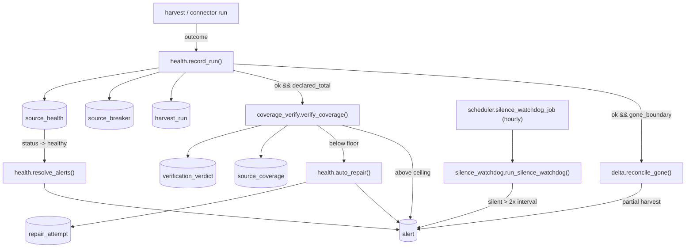

# CARDEEP — ERROR-ORIGIN MAP

> **Purpose.** The single diagnostic index for any agent debugging a live CARDEEP failure.
> For each failure class: **where it originates** (the exact module + table + alert origin),
> **how to diagnose it** (the precise query / log line to run), and **what the auto-repair does
> next**. This is the operational complement to [`06-RESILIENCE-OPS.md`](06-RESILIENCE-OPS.md):
> that doc is the *design* of the watchdog/breaker/auto-repair; **this doc is the live wiring map
> as it actually runs in `pipeline/ops/`**, reconciled against the running DB.
>
> **Reconciliation note (read first).** `06-RESILIENCE-OPS.md` was written as the *spec* when the
> watchdog tables existed but nothing wrote them (`README.md §3` still says "S-HEALTH ⏳ tables
> live, nothing writes them yet — F7" — that line is **STALE**). As of `[VERIFIED DB 2026-06-22]`
> the loop is **LIVE**: `pipeline/ops/health.py` is the single writer, the scheduler runs
> (`apscheduler_jobs` = 6 jobs durable), and the tables carry real rows. Where the 06-spec and the
> live code disagree (table shapes, signal vocabulary), **the live code in `pipeline/ops/` governs**
> and the divergence is flagged §7 below.
>
> **Marking discipline.** Every claim is `[VERIFIED]` (read from repo/DB this session) or
> `[ASSUMED]`. Counts/paths are exact.
>
> **Country-agnostic vs ES-specific.** The entire failure-origin machine (watchdog, breaker,
> coverage gate, alert/origin contract, auto-repair ladder) is **COUNTRY-AGNOSTIC** — it keys on
> `source_key`, not on Spain. Only the *anchors* a few failure classes compare against are
> **ES-SPECIFIC** (DIRCE-451 census, FACONAUTO, DGT CAT — `countries/ES/census/`). A new country
> reuses every module here unchanged and supplies its own census anchors. Flagged per-row.

---

## 0. The exact-origin contract (how to read every alert)

Every failure in CARDEEP is attributed to a **machine-readable origin key** before any response
is chosen. The canonical form `[VERIFIED `pipeline/ops/health.py:289-292` `build_origin()`]`:

```
origin = "<source_key>:<phase>[:<cdp_code>]"
   e.g.  "coches_net_wholesale:coverage"        (a whole-source coverage fault)
         "as24:gone_guard:CDP-ES-28-J8BM89V8"   (a per-dealer GONE-sweep suppression)
         "motor_es_wholesale:silence"           (a source that stopped running)
```

The live `phase` values observed in the DB `[VERIFIED 2026-06-22, distinct `alert.origin` phases]`:
`scrape`, `coverage`, `silence`, `gone_guard`. The 06-spec also names `discover/recipe/ingest/`
`verify/fetch/geocode` as designed phases — those are valid but not all currently emitting.

**The four diagnostic tables (PostgreSQL is the metrics store — no external TSDB):**

| Table | What it records | Single writer | Migration |
|---|---|---|---|
| `source_health` | per-source `status` + `consecutive_fails` + `last_ok`/`last_fail` + `coverage_floor` + `is_tier1` + `harvest_interval_hours` + `tuning` | `health.record_run()` | `0004` + `0013` + `0024` cols `[VERIFIED]` |
| `source_breaker` | per-source breaker `state` + `opened_at` + `cooldown_until` + `consecutive_fails` | `health.record_run()` | `0013` `[VERIFIED]` |
| `harvest_run` | one audit row per run: `ok`/`rows`/`error`/`http_status`/`started_at`/`finished_at` | `health.record_run()` | `0013` `[VERIFIED]` |
| `repair_attempt` | one row per auto-repair: `detected_reason`/`action`/`succeeded` | `health.auto_repair()` | `0013` `[VERIFIED]` |
| `alert` | exact-origin alerts: `origin`/`severity`/`message`/`payload`/`resolved_at` | `health.fire_alert()` + `silence_watchdog` | `0004` `[VERIFIED]` |

**Live state `[VERIFIED DB 2026-06-22]`:** 56 `source_health` rows (50 healthy / 2 degraded /
4 unknown) · 51 `source_breaker` (all `closed`, 0 open) · 387 `harvest_run` · 40 `repair_attempt`
(36 `escalate_owner`/ok · 1 `quarantine`/ok · 3 `refingerprint`/not-yet — P10 spend-gated) ·
68 alerts (47 unresolved).



---

## 1. THE MASTER LOOKUP TABLE (failure class → origin → diagnosis)

The seven live failure classes. Each row is the entry point; §2–§6 expand the non-obvious ones.

| # | Failure class | Alert `origin` shape | Originates in (module) | Recorded in | First diagnostic query |
|---|---|---|---|---|---|
| 1 | **Connector down** (crash / timeout / exit≠0) | `<src>:scrape` | the connector `pipeline/platform/*.py`; safety-net in `scheduler._record_crash_if_unrecorded` | `harvest_run` (`ok=false`,`error`) + `source_health` | `SELECT * FROM harvest_run WHERE source_key=$1 ORDER BY started_at DESC LIMIT 5;` |
| 2 | **Source silent** (stopped running, never even fails) | `<src>:silence` | `pipeline/ops/silence_watchdog.py` (hourly job) | `alert` (`origin LIKE '%:silence'`) | `SELECT origin,message FROM alert WHERE origin LIKE '%:silence' AND resolved_at IS NULL;` |
| 3 | **Breaker open** (3 consecutive fails) | (no own alert; from §1/§5) | `health.record_run()` §5 logic; `health.is_open()` is the gate | `source_breaker` (`state='open'`,`cooldown_until`) | `SELECT * FROM source_breaker WHERE state<>'closed';` |
| 4 | **VAM REFUTED** (quorum broke / data wrong) | `<src>:scrape` or `:coverage`, sev `critical` | `pipeline/verify.py` (`record_count_verdict`) → routed by caller | `verification_verdict` (`verdict='REFUTED'`) + `alert` | `SELECT subject_key,claim,verdict,divergence FROM verification_verdict WHERE verdict='REFUTED' ORDER BY created_at DESC LIMIT 20;` |
| 5 | **Coverage out of band** (under-floor / over-ceiling) | `<src>:coverage` | `pipeline/ops/coverage_verify.py` | `source_coverage` + `verification_verdict` + `alert` | `SELECT source_key,coverage_pct,verdict FROM source_coverage ORDER BY probed_at DESC;` |
| 6 | **GONE-sweep suppressed** (partial harvest, dedup of bajas withheld) | `<src>:gone_guard:<cdp>` | `pipeline/delta.py` `reconcile_gone` (gate in `health.py:269-284`) | `alert` (`origin LIKE '%:gone_guard:%'`) | `SELECT origin,message FROM alert WHERE origin LIKE '%:gone_guard:%' AND resolved_at IS NULL;` |
| 7 | **Geocode fail** (entity not resolved to municipio) | (no live alert phase yet) | `pipeline/geocode.py` / `pipeline/geo.py` | `entity` (`municipality_code IS NULL`, `province_code='XX'`) | `SELECT province_code,count(*) FROM entity WHERE municipality_code IS NULL GROUP BY 1;` |
| 8 | **Seal not moving** (strata stuck < 95%) | (no alert; reported in DB view) | `pipeline/exhaustiveness/*` + orthogonal-list discovery | `exhaustiveness_estimate` + `v_exhaustiveness_seal` | see §6 |
| 9 | **RAM-gate** (full-DB union-find OOM) | (operator-side, no auto-alert) | `pipeline/identity/*` cluster jobs on 16 GB host | n/a (job aborts) | see §5.4 |
| 10 | **Encoding crash** (Windows cp1252 on `→`/`Σ`) | surfaces as §1 connector-down | any module printing non-ASCII to stdout under Windows | `harvest_run.error` | see §2.5 |

---

## 2. Connector down + silence (the "a source stopped producing" family)

### 2.1 Connector down — origin `<src>:scrape`

**Where it originates.** A connector in `pipeline/platform/*.py` raises, times out, or exits
non-zero. Connectors **own their own `record_run`** on every normal path (`scheduler.py:367` — "the
connector is responsible for writing its own record_run — the scheduler does NOT")
`[VERIFIED]`. When a connector dies *before* reaching its `record_run` (SIGKILL on the 4 h
`SUBPROCESS_TIMEOUT_SEC`, launch failure, early crash), the scheduler's safety net
`_record_crash_if_unrecorded()` (`scheduler.py:422-464`) writes the failure itself — but **only if
no new `harvest_run` row appeared this cycle** (it captures the high-water `max(id)` before launch,
`scheduler.py:400-419`), so a connector that did record its own outcome is never double-counted
`[VERIFIED]`.

**How to diagnose.**
```sql
-- the last runs of a source, with the error text and HTTP status
SELECT started_at, finished_at, ok, rows, http_status, left(error, 200)
FROM harvest_run WHERE source_key = $1 ORDER BY started_at DESC LIMIT 10;
-- its current health posture
SELECT status, consecutive_fails, last_ok, last_fail FROM source_health WHERE source_key = $1;
```
The scheduler log (stdout, prefix `[scheduler]`) wraps each launch: `LAUNCH <src> -> python -m ...`,
then `OK <src> (exit=0)` or `FAIL <src> (exit=N)` (`scheduler.py:376,393-396`) `[VERIFIED]`.

**What auto-repair does.** `record_run(ok=False)` increments `consecutive_fails`, sets `status`
(`degraded` at 1, `down` at 3), and the **same call** trips the breaker `open` at 3 with an
exponential cool-down (`health.py:215-234`). The classification + repair is driven by `auto_repair()`
(§4). COUNTRY-AGNOSTIC.

### 2.2 Source silent — origin `<src>:silence`

**Where it originates.** `pipeline/ops/silence_watchdog.py`, run hourly by the scheduler
(`scheduler.py:849-859`, job id `silence_watchdog`). A source is **silent** when
`now() - COALESCE(last_ok,last_fail,'1970-01-01') > 2 × harvest_interval_hours`
(`SILENCE_MULTIPLIER=2`, `silence_watchdog.py:46,68-83`) `[VERIFIED]`. This catches the blind spot
§1 cannot: a connector that **never runs at all** never writes a `harvest_run`, so only the
silence watchdog notices. Severity = `critical` if `is_tier1` else `warning`.

**How to diagnose.**
```sql
SELECT origin, severity, left(message,80), payload->>'hours_silent'
FROM alert WHERE origin LIKE '%:silence' AND resolved_at IS NULL ORDER BY severity;
```
Or read-only CLI: `python -m pipeline.ops.scheduler --check-silence` (`scheduler.py:748-795`).

**Live reading `[VERIFIED 2026-06-22]`.** Two distinct silence sub-classes are present and the
diagnosis differs:
- **Real silent sources** (a connector that genuinely stopped): `coches_com_wholesale` 168.3 h,
  `motor_es_wholesale` 169.0 h, `coches_net_segments` 186.6 h, `borme_cnae` 55.6 h. Diagnose by
  the §1 path on that `source_key`; the harvest fleet is operator-paced and these reflect the loop
  being paused since mid-June (PROGRESO: "cosecha PARADA").
- **Phantom silence** (a discovery `source_key` seeded into `source_health` but with no scheduled
  connector): `collapse_invisible`, `dork_municipal`, `graph_recursive`, `overture` at
  **495040.8 h** — that is the epoch fallback (`'1970-01-01'`), i.e. the row has **never** had a
  `last_ok`/`last_fail`. These are **not connector failures**; they are unscheduled discovery
  source-keys. Cross-check against the scheduler `REGISTRY`: `python -m pipeline.ops.scheduler
  --dry-run` prints the `UNMAPPED (gap)` list (`scheduler.py:702-709`). A source in `source_health`
  with no `REGISTRY` entry is silent forever by construction. COUNTRY-AGNOSTIC.

### 2.3 The scheduler itself (durable, single-producer) — `[VERIFIED LIVE]`

`apscheduler_jobs` = **6 durable jobs** `[VERIFIED DB]` (`heartbeat_tick` 15 min, `silence_watchdog`
1 h, `inquisition_cadence` 6 h, `inquisition_prosecute` 6 h+30 min, `gestionador_detect` 24 h,
`canonical_key_backfill` 24 h — `scheduler.py:834-923`). Crash-safe via
`SQLAlchemyJobStore` on `cardeep-pg`. **Single-producer is enforced two ways**: `max_instances=1`
(no overlapping ticks in one process) AND a **PG session advisory lock** `0x43415244` ('CARD',
`scheduler.py:813-824`) that refuses a *second* scheduler process on the host — the direct guard
against the AS24 "two governors on one host" 4×-hammer scar. If the scheduler won't start, check
for a stale lock holder: `SELECT pid FROM pg_locks WHERE locktype='advisory' AND objid=1128354372;`
`[ASSUMED objid decomposition — the lock key is 1128354372]`. COUNTRY-AGNOSTIC.

### 2.4 Due-selection / breaker skip

`_due_sources()` (`scheduler.py:296-336`) selects sources where
`now() - COALESCE(last_ok,last_fail,'1970-01-01') >= harvest_interval_hours * interval '1 hour'`,
**most-overdue first**, and **skips any with `consecutive_fails >= BREAKER_TRIP_AT (3)`**
`[VERIFIED]`. So a source stuck "down" is not retried until a clean run resets the streak — if a
source is silently never harvested, confirm it is not breaker-skipped:
`SELECT source_key,consecutive_fails,status FROM source_health WHERE consecutive_fails>=3;`

### 2.5 Encoding crash (the cp1252 / `→` / `Σ` class) — `[VERIFIED still live]`

**Where it originates.** Any module printing a non-ASCII char (the arrow `→ →`, `Σ Σ`) to
stdout on Windows with the default `cp1252` codec raises `UnicodeEncodeError`, killing the process
mid-run → surfaces as a §1 connector-down with an exit≠0. This is the historical "alert id 6
coches_com Sigma crash" (`scheduler.py:370-372`). **The fix is wired**: the scheduler injects
`PYTHONIOENCODING=utf-8` into every child connector's env (`scheduler.py:377`) `[VERIFIED]`. **But
it only covers scheduler-launched subprocesses** — an ad-hoc script run directly (e.g. a debug query
printing a `blocking_rules` JSON that contains `→`) still crashes. Diagnose: the `harvest_run.error`
or stack trace names `cp1252` + a `\uXXXX` position. Workaround for any manual run:
`PYTHONIOENCODING=utf-8 python ...`. COUNTRY-AGNOSTIC (Windows-host-specific).

---

## 3. Breaker open + the auto-repair ladder

### 3.1 Breaker state machine — origin: the §1 fail that tripped it

**Where it originates.** `health.record_run()` (`health.py:191-243`) is the breaker writer, sharing
`consecutive_fails` with `source_health` as the single source of truth. On the cycle where
`new_fails >= trip_at (3, tunable via `source_health.tuning.fail_threshold`)` it sets
`source_breaker.state='open'`, stamps `opened_at`, and computes an **exponential cool-down**:
`cool = min(base 900s × 2^(fails − trip_at), 86400s/24h)` (`health.py:225`) `[VERIFIED]` — "a source
that keeps tripping cools longer". A clean run closes it (`state='closed'`, counters reset,
`health.py:199-214`).

**The gate.** `health.is_open()` (`health.py:443-466`) is what harvest code calls **before** running
a source: returns `True` (skip) while `state='open'` and `now() < cooldown_until`; once the cool-down
elapses it flips the row to `half_open` and returns `False` so **exactly one** canary probe is
allowed through (06 §5.1, "never declare victory on one request"). `[VERIFIED]`

**How to diagnose.**
```sql
SELECT source_key, state, opened_at, cooldown_until, consecutive_fails
FROM source_breaker WHERE state <> 'closed';
-- ETA to next probe: cooldown_until - now()
```
Live: **0 breakers open** `[VERIFIED 2026-06-22]` (all 51 `closed`). COUNTRY-AGNOSTIC.

### 3.2 Auto-repair ladder — origin recorded as the chosen `action`

**Where it originates.** `health.auto_repair()` (`health.py:381-440`) classifies the failure text
+ HTTP status via `classify_failure()` (`health.py:340-372`) into a **closed action vocabulary**
(must match the `migrations/0013` CHECK), then writes a `repair_attempt` row and fires the
exact-origin alert. The mapping `[VERIFIED]`:

| Observation (in `error`/`http_status`) | Action | `succeeded` now | Note |
|---|---|---|---|
| 401/403, `blocked`/`forbidden`/`challenge`/`captcha`/`cloudflare` | `refingerprint` | **FALSE** | spend-gated (P10): classification+audit+alert run, **effect deferred** (`health.py:419-424`) |
| `akamai`/`datadome`/`perimeterx`/`sensor`/`residential` | `escalate_tier` | **FALSE** | spend-gated (P10) |
| 429, `rate limit`/`throttl`/`ban`/`too many` | `quarantine` | TRUE | €0: the breaker cools the source |
| `null`/`drift`/`schema`/`field`/`selector`/`json path`/`no listings`/`parse` | `re_receta` | **FALSE** | spend-gated (P10); severity `critical` |
| anything else (unknown / unrepairable) | `escalate_owner` | TRUE | €0: the honest wall, recorded for the owner; severity `critical` |

**Critical to understand for debugging:** `refingerprint`/`escalate_tier`/`re_receta` are
**P10-SCAFFOLDED** — the classification, the `repair_attempt` audit, and the alert all run for real,
but the spend-bearing *effect* is `succeeded=FALSE` until the P10 spend gate authorizes it
(`health.py:375-378,408-424`). So a `repair_attempt` with `action='refingerprint', succeeded=false`
is **not a bug** — it is the loop honestly parking a wall that needs money. `[VERIFIED]`

**How to diagnose.**
```sql
SELECT source_key, action, succeeded, detected_reason, created_at
FROM repair_attempt ORDER BY created_at DESC LIMIT 30;
```
Live: 36 `escalate_owner` (the dominant outcome — €0 honest walls), 1 `quarantine`, 3
`refingerprint` (pending P10) `[VERIFIED 2026-06-22]`. COUNTRY-AGNOSTIC.

---

## 4. VAM REFUTED (the integrity tripwire)

**Where it originates.** `pipeline/verify.py` `record_count_verdict()` — the count-quorum judge.
A verdict is `REFUTED` when the orthogonal paths diverge beyond `tolerance`, or specifically when
**ingestion silently lost rows** (the landed-DB count must agree with ≥1 independent path). The
verdict lands in `verification_verdict` (`verdict` column, plus `divergence`, `primary_path`,
`independent_values`, `quorum_n`/`family_n`/`origin_n`, `expires_at`) `[VERIFIED schema]`. A caller
that gets a REFUTED routes it to `health.record_run(ok=False)` / `auto_repair()` and fires a
`critical` alert.

**Live reading `[VERIFIED 2026-06-22]`.** `family_unreachable:scrape` is `critical`: "VAM verdict
REFUTED -> auto-repair action 'escalate_owner'". `verification_verdict` total = 1322 rows. To find
the worst current refutations:
```sql
SELECT subject_type, subject_key, claim, divergence, created_at
FROM verification_verdict WHERE verdict='REFUTED' AND superseded_by IS NULL
ORDER BY created_at DESC LIMIT 20;
```

**Two REFUTED sub-classes to distinguish when debugging:**
1. **Real integrity break** (ingest lost rows, paths genuinely diverge) → fail-closed, do not serve.
2. **Scope-mismatch false-REFUTED** — the coverage gate (§5) deliberately **overrides** a REFUTED to
   `UNVERIFIED` for over-coverage, because comparing a cumulative all-runs `captured_db` against a
   single-segment `declared_total` is a *measurement* artifact, not bad data
   (`coverage_verify.py:235-253`). This is why over-ceiling sources read `UNVERIFIED`, not `REFUTED`.

The verdict has a freshness TTL: `inquisition_cadence` (scheduler, 6 h) re-queues expired verdicts
(`expires_at < now()`) for re-verification. COUNTRY-AGNOSTIC.

---

## 5. Coverage out of band + the net-dedup collision class

### 5.1 Where it originates

`pipeline/ops/coverage_verify.py` `verify_coverage()`, called automatically by
`record_run(ok=True, declared_total=...)` (`health.py:258-267`) `[VERIFIED]`. It compares three
orthogonal paths — **Path A `captured_db`** (`SELECT count(DISTINCT vehicle_ulid) FROM vehicle JOIN
entity_source ... WHERE status='available' AND es.source_key=$1`, `coverage_verify.py:133-139`),
**Path B `db_edges`** (`platform_listing` count), **declared_total** (the source's own oracle) —
and writes `source_coverage` + a `verification_verdict`, then fires/resolves `<src>:coverage`.

The band (`coverage_verify.py:43,49`): floor = per-source `source_health.coverage_floor` (default
**0.85**), ceiling = **1.15**. `coverage_pct = captured_db / declared_total`.

### 5.2 Under-floor (`coverage_pct < floor`) — a real partial drain

**Genuinely incomplete**: pagination broke, ban mid-drain, keyword sweep didn't reach the tail.
Fires a `warning` alert AND calls `auto_repair(..., 'low_coverage')` → `re_receta`
(`coverage_verify.py:292-304`). Live: `as24_wholesale:coverage` low_coverage (the AS24 proof-slice
is intentionally a 12-page slice, sealed UNVERIFIED by manual reclassification, not full coverage),
`coches_net_segments:coverage`, `racc_ocasion_wholesale:coverage` `[VERIFIED]`.

### 5.3 Over-ceiling (`coverage_pct > 1.15`) — the net-dedup collision class `[VERIFIED]`

**This is the most important debugging insight in this doc.** When `captured_db` is the
**cumulative all-runs distinct count** of *listings* and `declared_total` is one segment's total, the
ratio blows past 100%. The gate forces the verdict to **`UNVERIFIED`** (NOT `REFUTED`) and fires a
`warning` carrying **both hypotheses** in the payload (`coverage_verify.py:305-330`):
- `b9v2_hypothesis_a`: declared under-scoped (multi-segment/run mismatch) — a *metric* artifact.
- `b9v2_hypothesis_b`: DB inflated (intra-source dups or stale-`available` never marked GONE) — real.

Live over-ceiling alerts `[VERIFIED 2026-06-22]`: `coches_com_wholesale` **9092%**,
`milanuncios_wholesale` **1828%**, `motorflash_wholesale` **361%**, `coches_net_wholesale` 123%,
`group_vo_chains_clicars` 123%, `oem_toyota_lexus` 121%, `oem_mini_next` 120%, `oem_audi` 115%.

**How to disambiguate hypothesis (a) vs (b).** The systemic root of the marketplace over-counts is
that one physical car appears as N listings across platforms. That is exactly what the **net vehicle
dedup** now measures: `v_canonical_vehicle` (run `vehicle-identity-det-v1`, `vam_verified=TRUE`,
`[VERIFIED DB 2026-06-22]`) collapses **2,262,673 listings → 1,939,474 unique cars** (323,199 merges,
14.28%). milanuncios alone: 244k listings → 122k cars; wallapop 87k → 50k (PROGRESO). So an
over-ceiling milanuncios is hypothesis (a)+cross-platform-duplication, **not** ingest corruption — the
served truth is the deduped count, and the raw `captured_db` over-count is expected until the phase-2
full-index probe aligns scopes. Diagnose:
```sql
SELECT source_key, declared_total, captured_db, db_edges, coverage_pct, verdict
FROM source_coverage ORDER BY coverage_pct DESC NULLS LAST LIMIT 20;
```
COUNTRY-AGNOSTIC (the dedup signals — photo_url, firma — are universal; the merge run is per-corpus).

### 5.4 RAM-gate (why full-DB dedup was historically blocked) — `[VERIFIED resolved for vehicles]`

**Where it originates.** A full-DB union-find (`pipeline/identity/*`) over ~2.3M rows needs ~4–6 GB;
the 16 GB AMD host (no GPU) has only ~2.5 GB free with the worker fleet alive → OOM. This is why
`SPAIN_SEALED.md §0-bis` historically listed "dedup neto servido — GATED por RAM". **Now closed for
vehicles**: the run was executed over the `status='available'` slice with stock-photo / null-price
guards (`vehicle_cluster_run.blocking_rules`), `vam_verified=TRUE` `[VERIFIED]`. Diagnose a stuck
cluster job: `pg_stat_activity` (wait_event), and watch host RAM. The lock-hygiene rule
(`MISSION.md §4`) applies: never `DROP TABLE ... CASCADE` on a table a concurrent job uses; idle
orphan connections hold `AccessShareLock` and block others. COUNTRY-AGNOSTIC.

---

## 6. GONE-sweep suppression + seal not moving

### 6.1 GONE-sweep suppressed — origin `<src>:gone_guard:<cdp>`

**Where it originates.** `pipeline/delta.py` `reconcile_gone()`, gated inside
`health.record_run()` (`health.py:269-284`) `[VERIFIED]`. After a successful run, vehicles a source
owns that were **not re-seen** since the harvest boundary would be retired (status→GONE + event). But
retirement only fires when the run's B9 `coverage_pct >= _GONE_MIN_COVERAGE (0.9)` (`health.py:40`) —
a **partial harvest must not mass-retire** real cars as if they vanished. When suppressed, a
`warning` `<src>:gone_guard:<cdp>` alert records the withheld sweep. This is a **safety brake, not a
fault** — it is the system refusing to delete the served universe on incomplete evidence (law #4,
fail-closed on integrity). Live: ~28 `as24:gone_guard:CDP-ES-*` alerts (the AS24 proof-slice is
partial by design) `[VERIFIED 2026-06-22]`.

**How to diagnose.**
```sql
SELECT origin, left(message,120) FROM alert
WHERE origin LIKE '%:gone_guard:%' AND resolved_at IS NULL LIMIT 50;
```
Resolution: a full-coverage harvest of that source clears the brake. COUNTRY-AGNOSTIC.

### 6.2 Seal not moving (strata stuck < 95%) — the identifiability ceiling

**Where it originates.** `pipeline/exhaustiveness/*` writes `exhaustiveness_estimate`
(one row per province×segment per run) and `v_exhaustiveness_seal`. A stratum is `sealed=TRUE` when
`coverage_lower = n_obs / ci_high >= seal_threshold (0.95)` (capture-recapture). `[VERIFIED schema]`

**Live `[VERIFIED DB 2026-06-22, latest run `seal-splink-20260622`, 210 strata]`: 14 sealed.**
By segment (n / sealed / coverage_point): concesionario 53/**10**/0.710 · desguace 52/**3**/0.400 ·
otros 52/**1**/0.472 · **compraventa 52/0/0.134** · (1 null-segment row 0/0.728).

**The root cause of "compraventa won't seal" (debug this correctly):** it is **not** under-coverage.
The DB has ~66k compraventa entities vs ~23k registral CNAE-451 locales — CARDEEP discovered *more*
than the registral ceiling. The MSE cannot **bound** the population because the **orthogonal discovery
lists barely overlap** (low capture-recapture `m`) → `ci_high` explodes → `coverage_lower ≈ 0`. It is
a limit of **statistical identifiability**, not real coverage. `[VERIFIED SPAIN_SEALED.md §0-bis]`

**What does NOT move the seal (verified dead ends):**
- The net vehicle dedup (§5.3) — re-running the MSE with it integrated (`seal-splink-20260622`)
  produced **14**, identical to the prior `iter2-resolved` run. Dedup fixes *honest counts*, not the
  orthogonal-list overlap. `[VERIFIED — both runs = 14]`
- The 2nd-orthogonal-list densification was exhausted across 7 angles at €0.

**What would move it:** densifying orthogonal discovery lists per province (DORK/REG/DGT/ASSOC) so
≥2 overlap — a gated data campaign. The honest DONE the owner accepts = **sealed-OR-gap-with-cause**,
with the registral cross-check (2.9× DIRCE). Diagnose:
```sql
SELECT segment, count(*) n, sum(sealed::int) sealed, round(avg(coverage_point)::numeric,3) cov
FROM exhaustiveness_estimate
WHERE build_run_id = (SELECT build_run_id FROM exhaustiveness_estimate ORDER BY created_at DESC LIMIT 1)
GROUP BY segment ORDER BY segment;
```
**ES-SPECIFIC anchors** (`countries/ES/census/dirce_cnae451.csv` `[VERIFIED exists]`, FACONAUTO,
DGT CAT). A new country supplies its own legal census; the MSE machine is COUNTRY-AGNOSTIC. See
[`SPAIN_SEALED.md`](../SPAIN_SEALED.md) and [`05-VERIFICATION-VAM.md`](05-VERIFICATION-VAM.md) /
[`verification/V1-DENOMINATOR-PROOF.md`](verification/V1-DENOMINATOR-PROOF.md).

---

## 7. Spec-vs-live drift (06-RESILIENCE-OPS reconciliation)

The live `pipeline/ops/` code **governs**; `06-RESILIENCE-OPS.md` is the design intent. The
substantive divergences a debugging agent must know `[VERIFIED]`:

| 06-spec design (§10) | Live reality (`migrations/0013` + DB) | Implication for debugging |
|---|---|---|
| `harvest_run (cycle_id, phase, tier, outcome, records_in/out, declared_count, null_rates, signal, duration_ms, retries)` | `harvest_run (id, source_key, started_at, finished_at, ok, rows, error, http_status)` | Query the **live** columns. There is no `cycle_id`/`outcome`/`null_rates` column. Drift detection by `null_rates` is **not** wired; coverage is the live integrity signal instead. |
| `repair_attempt (alert_id, signal, rung, outcome ∈ recovered/failed/escalated/parked)` | `repair_attempt (id, source_key, detected_reason, action, succeeded boolean, created_at)` | No `alert_id` FK link, no `rung`/`signal`. The action vocabulary is the §3.2 set, not the rung names. |
| `signal` typed vocabulary (`rate_limited`/`recipe_drift`/`challenge_wall`...) | `action` vocabulary (`refingerprint`/`escalate_tier`/`re_receta`/`quarantine`/`escalate_owner`) | Map a 06-`signal` to the live `action` via `classify_failure()` (§3.2). |
| Migration `0005_resilience_ops.sql` adds breaker/run/repair | Actually `migrations/0013_resilience.sql` (and `0004` for health/alert) | The resilience DDL is `0013`, not `0005` (`0005` is `types_and_guards`). |
| `README.md §3`: "S-HEALTH ⏳ tables live, nothing writes them yet — F7"; §7: "~12,862 entities, ~39k vehicles, 0 source_health/alert rows" | S-HEALTH **LIVE**; **419,563 entities · 2,291,776 vehicles · 56 source_health · 68 alerts · 387 harvest_run** | `README.md §3/§7 are STALE`. Trust the DB; treat that README section as historical. |

The 06-spec drift-detector (§4 golden-sample null-rate/count/distribution checks) is **partially**
realized: count-band drift lives as the §5 coverage gate; per-field null-rate/distribution drift is
**not yet wired** — a recipe that silently nulls a non-required field is currently caught only if it
pushes coverage out of band or trips a VAM REFUTED. `[VERIFIED — no `null_rates` column, no golden-`
`sample comparator in `pipeline/ops/`]` This is a real residual gap, declared, not papered over.

---

## 8. One-screen triage (the order to run when "something is wrong")

```sql
-- 1. What is broken right now, grouped by origin and severity?
SELECT split_part(origin,':',2) AS phase, severity, count(*)
FROM alert WHERE resolved_at IS NULL GROUP BY 1,2 ORDER BY 2,3 DESC;

-- 2. Which sources are unhealthy?
SELECT status, count(*) FROM source_health GROUP BY 1;
SELECT source_key, status, consecutive_fails, last_ok FROM source_health
WHERE status IN ('down','degraded','unknown') ORDER BY consecutive_fails DESC;

-- 3. Any breaker open (shedding a source)?
SELECT source_key, state, cooldown_until FROM source_breaker WHERE state <> 'closed';

-- 4. Integrity: recent REFUTED?
SELECT subject_key, claim, divergence FROM verification_verdict
WHERE verdict='REFUTED' AND superseded_by IS NULL ORDER BY created_at DESC LIMIT 10;

-- 5. Coverage out of band?
SELECT source_key, coverage_pct, verdict FROM source_coverage
WHERE coverage_pct < 0.85 OR coverage_pct > 1.15 ORDER BY coverage_pct DESC NULLS LAST;

-- 6. What did auto-repair last decide?
SELECT source_key, action, succeeded, detected_reason FROM repair_attempt
ORDER BY created_at DESC LIMIT 15;
```
Heartbeat health: `python -m pipeline.ops.scheduler --dry-run` (due sources + REGISTRY gaps) and
`--check-silence` (silent sources, read-only).

---

## 9. Cross-links

- [`06-RESILIENCE-OPS.md`](06-RESILIENCE-OPS.md) — the design spec this doc maps to live code (§7 reconciles the drift).
- [`04-ORCHESTRATION.md`](04-ORCHESTRATION.md) — the control plane / scheduler / rate-governor.
- [`05-VERIFICATION-VAM.md`](05-VERIFICATION-VAM.md) + [`verification/V1-DENOMINATOR-PROOF.md`](verification/V1-DENOMINATOR-PROOF.md) — VAM verdicts and the capture-recapture seal (§4, §6.2).
- [`11-IDENTITY-RESOLUTION-AUTHORITY.md`](11-IDENTITY-RESOLUTION-AUTHORITY.md) — the dealer/vehicle dedup that underlies the net-dedup collision class (§5.3) and the RAM-gate (§5.4).
- [`02-SCRAPING-ENGINE.md`](02-SCRAPING-ENGINE.md) — the fetch tiers + recipe `heal:` block the auto-repair ladder (§3.2) escalates through.
- [`../SPAIN_SEALED.md`](../SPAIN_SEALED.md) — the seal numbers (§6.2) in full.
- [`../MISSION.md`](../MISSION.md) — the mandate, invariants, lock-hygiene (§5.4), live migration state.

---

## 10. Sources (repo + DB verified 2026-06-22)

- `pipeline/ops/health.py` — `record_run` (single writer), `auto_repair`, `classify_failure`, `fire_alert`, `resolve_alerts`, `is_open`, `build_origin`.
- `pipeline/ops/scheduler.py` — durable APScheduler 3.x, 6 jobs, advisory-lock singleton, crash safety-net, `--dry-run`/`--check-silence`, UTF-8 child env.
- `pipeline/ops/silence_watchdog.py` — silence detection (`2× interval`), dedup-aware alerting.
- `pipeline/ops/coverage_verify.py` — the B9 coverage gate (floor 0.85 / ceiling 1.15), over-coverage→UNVERIFIED scope classification.
- `pipeline/verify.py` — `record_count_verdict` (VAM REFUTED origin).
- `pipeline/delta.py` `reconcile_gone` — GONE-sweep + the `gone_guard` coverage brake.
- `migrations/0004_verification_health.sql` (health/alert) + `0013_resilience.sql` (breaker/run/repair) + `0024_source_coverage.sql`.
- Live DB `cardeep-pg :5433`: tables and counts in §0; seal run `seal-splink-20260622` (14/210); net dedup run `vehicle-identity-det-v1` (1,939,474 / 2,262,673).
```
