# CARDEEP — Replication Guide (add a new country)

> **What this doc is.** The exact, verified recipe to replicate CARDEEP from Spain
> (`ES`) to a new country `XX` (the owner's EU → world goal). It separates the
> **country-agnostic core** (engine, pipeline, data model, API — replicable as-is)
> from the **ES-specific surface** (`countries/ES/*`, the INE geo backbone, the
> per-source adapters, the census anchors), gives a **step-by-step `add country XX`
> checklist**, and — critically — flags every **ES assumption baked into the core
> that BLOCKS replication** as a concrete gap to fix before `XX` can run.
>
> **Marking discipline.** Every load-bearing claim is `[VERIFICADO]` (read from a
> file or proven by a DB query this session) or `[ASUMIDO]` (design judgment, not
> yet on disk). No invented paths/tables/fields. Cross-links to the pillars use
> their on-disk names under `docs/ARCHITECTURE/`.
>
> **Honesty up front:** CARDEEP today is a **single-country (ES) system**. The DB
> holds **419,563 entities, all `CDP-ES-*`** `[VERIFICADO]`; there is **no
> `country_code` column anywhere** `[VERIFICADO]`; the country `ES` is **hard-coded
> in the identity mint, the geo schema, the raw/recipe paths, the census seam, and
> the price gate** `[VERIFICADO]`. This guide is therefore part *recipe*, part
> *refactor spec*: §4 lists what already replicates cleanly, §5 lists the blockers
> that must be fixed first, §6 is the checklist that assumes §5 is done.

Cross-links: [README](README.md) · [01-ENTITY-ONTOLOGY](01-ENTITY-ONTOLOGY.md) ·
[02-SCRAPING-ENGINE](02-SCRAPING-ENGINE.md) · [03-DATA-MODEL](03-DATA-MODEL.md) ·
[05-VERIFICATION-VAM](05-VERIFICATION-VAM.md) · [07-COVERAGE-STRATEGY](07-COVERAGE-STRATEGY.md) ·
[08-REPO-ORGANIZATION](08-REPO-ORGANIZATION.md) · [11-IDENTITY-RESOLUTION-AUTHORITY](11-IDENTITY-RESOLUTION-AUTHORITY.md)

---

## 1. The replication thesis (one screen)

CARDEEP is conceptually **one generic machine × N country configs**. The machine
(fetch ladder, recipe runner, delta engine, identity mint, capture-recapture,
publish-gate, API) knows nothing about cars-in-Spain *in principle*; the knowledge
of *which* sources exist, *what* the geo grid is, and *which* official census
anchors the denominator lives in `countries/ES/*` + a handful of ES adapter
modules. **In principle** adding a country is: clone the config surface, swap the
geo backbone, write the per-source adapters, drop the census anchor. **In
practice** five core modules currently hard-code `ES` and must be parametrized
first (§5) — they are small, localized, and reversible to fix.

```mermaid
flowchart LR
  subgraph CORE["COUNTRY-AGNOSTIC CORE  (replicable as-is once §5 done)"]
    ENG["pipeline/engine/* — tiered fetch, governor, proxies"]
    REC["pipeline/recipe*.py — recipe schema + runner"]
    DLT["pipeline/delta*.py, ingest.py — NEW/GONE/Δprice/Δkm delta engine"]
    EXH["pipeline/exhaustiveness/* — capture-recapture N̂, seal"]
    INQ["pipeline/inquisition/*, gestionador/* — adversarial verify"]
    API["services/api/* — FastAPI envelope, routers"]
    DM["migrations/* — entity / vehicle / event / verdict schema"]
  end
  subgraph ES["ES-SPECIFIC SURFACE  (clone per country)"]
    GEO["geo backbone: geo_province/geo_municipality + load_geo.py (INE)"]
    SRC["pipeline/sources/* + pipeline/platform/* (per-source adapters)"]
    REG["countries/ES/recipes, _platforms, _tier1 (recipe bundles)"]
    CEN["countries/ES/census (DGT/DIRCE/FACONAUTO anchors)"]
    IDN["identity: cdp_code 'CDP-ES-' prefix, phone_es.py"]
  end
  CORE -->|reads config from| ES
```



---

## 2. The country-coupling census (every `ES` touch-point, verified)

This is the exhaustive inventory of where the country leaks into the system. Each
row is `[VERIFICADO]` against the cited file/query. **A**(gnostic) means "no change
to replicate"; **S**(pecific) means "clone/replace per country"; **B**(locker)
means "core code hard-codes ES — must be parametrized first (§5)".

| Surface | Where | Coupling | Class |
|---|---|---|---|
| Identity mint | `services/api/codes.py:89` — `f"CDP-ES-{province_code}-{...}"` | literal `ES` baked into every code | **B** |
| Geo schema | `migrations/0001_geo.sql` — `geo_province CHAR(2)`, `geo_municipality CHAR(5)`, `ccaa_code`, `CHECK left(code,2)=province_code` | INE 2+5-digit semantics, no `country_code` | **B** |
| Entity schema | `migrations/0002_entities.sql` — `province_code CHAR(2)`, `municipality_code CHAR(5)`, `cif`, `cnae`; no `country_code` | ES registral fields, ES geo widths | **B** |
| Geo backbone data | `scripts/load_geo.py` — hard-coded 52 `PROVINCES` + 19 `CCAA`, reads INE `diccionario_ine.xlsx` | the INE grid itself | **S** |
| Geo resolver | `pipeline/geo.py` — INE name→code cascade, bilingual ES names, ES province alias table, INE Nomenclátor gazetteer | ES name matching | **S** |
| Census / denominator anchor | `pipeline/exhaustiveness/triangulation.py:23` — `CENSUS_DIR = … "countries" / "ES" / "census"`; `seal.py:66` | DGT CAT + INE DIRCE + FACONAUTO, ES CNAE 451 | **B** path + **S** data |
| Segment map | `pipeline/exhaustiveness/capture.py:32` `_SEGMENT` (kind→{compraventa, concesionario, desguace, otros}) | aligned to the ES census strata | **S** (re-tune per anchor) |
| Recipe store path | `pipeline/recipe.py:58`, `recipe_schema.py:16`, `complete.py:305-309`, `evict.py:17,281` — `countries/ES/...` | literal `ES` in recipe load/persist/evict | **B** |
| Raw crude path | `pipeline/harvest_dealer.py:57` — `ROOT / "data" / "ES" / slug / "raw"` | literal `ES` in raw store | **B** |
| Source adapters | `pipeline/sources/*` (DGT CAT, OSM, OEM locators, census adapters) | each is an ES source | **S** |
| Platform adapters | `pipeline/platform/*` (~50 modules: AS24, coches.net, milanuncios, wallapop, OEM VO…) | each is an ES platform | **S** |
| Recipe bundles | `countries/ES/recipes/` (51), `_platforms/`, `_tier1/`, `census/` | the served ES catalog | **S** |
| Phone identity | `pipeline/identity/phone_es.py` — 9-digit `[6789]`, `+34` | ES numbering plan | **S** |
| Price gate | `pipeline/price_sanity.py` — €5M ceiling, EUR | EUR + ES market calibration | **S** (re-calibrate per currency/market) |
| Fetch engine | `pipeline/engine/*` (fetch, governor, proxies, ban_detector, tier1) | none — transport only | **A** |
| Recipe runner/schema | `pipeline/recipe_schema.py` dataclass (source, field_map, declared_path…) | schema is generic; values are ES | **A** (schema) |
| Delta engine | `pipeline/ingest.py`, `delta*.py` | none — operates on rows | **A** |
| Verify stack | `pipeline/inquisition/*`, `gestionador/*`, `verify*.py` | none — operates on counts/verdicts | **A** |
| API surface | `services/api/main.py` + `routers/*` | envelope/pagination generic; `/geo` assumes province/muni levels | **A** (mostly) |

> **The five blockers in one sentence:** the literal string `ES` is hard-coded in
> **(1)** the cdp_code mint, **(2)** the geo+entity schema (width + no country
> column), **(3)** the recipe store path, **(4)** the raw store path, and **(5)**
> the census seam path. Everything else is either pure config to clone (**S**) or
> already country-blind (**A**).

---

## 3. Anatomy of `countries/ES/` (the clone target)

`[VERIFICADO]` on disk. This is the directory you replicate to `countries/XX/`.

```
countries/
└── ES/
    ├── recipes/                 # flat per-dealer recipe.yaml bundles (51 files) [VERIFICADO]
    │   └── CDP-ES-00-3N995HG6.yaml ...
    ├── _platforms/              # national platform entities (province 00), by source_group:
    │   ├── marketplace_motor/   #   AS24, coches.net, milanuncios, wallapop ...
    │   ├── oem_vo_portal/       #   CUPRA Approved, Das WeltAuto, Spoticar ...
    │   ├── oem_dealer_network/  ├── chain/  ├── association/
    │   ├── official_registry/   └── long_tail_web/
    │   └── <group>/<cdp_code>/recipe.yaml
    ├── _tier1/                  # hard-defense platform bundles (14 dirs) [VERIFICADO]
    │   └── <cdp_code>/recipe.yaml
    └── census/                  # external denominator anchor [VERIFICADO]
        ├── dirce_cnae451.csv    #   province_code,segment,n_external  (the triangulation seam)
        └── SOURCE.md            #   provenance: which figure is MEDIDO vs ESTIMADO-DECLARADO
```

> The geo-hierarchical `countries/ES/<prov>/<comarca>/<city>/dealers/<code>/`
> layout described in [08-REPO-ORGANIZATION §2,§11](08-REPO-ORGANIZATION.md) is the
> **target** shape; `complete.py:297-298` `[VERIFICADO]` supports BOTH that and the
> legacy flat `recipes/` layout, so a new country may start flat and migrate later.
> The geo grid (provinces, comarcas, municipalities) lives in **PostgreSQL**, not
> in the directory tree — the tree is the recipe catalog, the DB is the geo source
> of truth.

---

## 4. The country-agnostic core (replicates as-is)

These need **no change** to serve a new country (once §5 parametrization lands).
`[VERIFICADO]` by reading each module's inputs:

1. **Fetch engine** — `pipeline/engine/{fetch,governor,proxies,ban_detector,
   source_fallback,ratelimit_pg,free_proxies}.py` + `engine/tier1/`. Pure
   transport: tiered ladder (curl_cffi → stealth → proxy), per-source rate
   governor, ban detection. Knows URLs and defenses, not countries. See
   [02-SCRAPING-ENGINE](02-SCRAPING-ENGINE.md).
2. **Recipe schema + runner** — `pipeline/recipe_schema.py` (the `RecipeV1`
   dataclass: `source`, `dealer_ref`, `field_map`, `declared_path`, defense, tier)
   `[VERIFICADO]`. The schema is generic; only the *values* in each YAML are ES.
3. **Delta / ingest engine** — `pipeline/ingest.py`, `delta.py`, `delta_guard.py`,
   `delta_photo.py`. NEW/GONE/Δprice/Δkm/Δphoto + append-only event log operate on
   rows, with no country logic. See [03-DATA-MODEL](03-DATA-MODEL.md).
4. **Exhaustiveness math** — `pipeline/exhaustiveness/{estimators,estimators_r,
   lists,splink_merge,seal}.py`. Chapman/log-linear capture-recapture and the seal
   are country-blind; only the **anchor CSV** they contrast against is ES (§5.5).
   See [05-VERIFICATION-VAM](05-VERIFICATION-VAM.md) and `verification/V1`.
5. **Verification / adversarial stack** — `pipeline/inquisition/*`,
   `pipeline/gestionador/*`, `pipeline/verify*.py`, `pipeline/price_sanity.py`
   logic (currency aside). Operates on counts and verdicts.
6. **Identity resolution** — `pipeline/identity/{resolve_entities,
   cross_source_dedup,cluster_dealers,cluster_vehicles,make_normalizer,
   canonical_key_backfill}.py`. The dedup/cluster logic is generic; the only
   country-tied helper is `phone_es.py` (clone as `phone_xx.py`, §6). See
   [11-IDENTITY-RESOLUTION-AUTHORITY](11-IDENTITY-RESOLUTION-AUTHORITY.md).
7. **Data model** — the bulk of `migrations/*` (vehicle/event/verdict/cluster/
   gestion/inquisition tables). Country-blind once the geo+entity schema gains a
   `country_code` (§5.2).
8. **API** — `services/api/main.py` envelope, pagination, auth, rate-limit, cache,
   and most routers. The `/geo` router assumes a province→municipality hierarchy
   (`routers/geo.py` `[VERIFICADO present]`); two-level geo is a reasonable
   default for most EU countries but is an `[ASUMIDO]` fit — confirm per country.

---

## 5. The blockers — ES baked into core, must be parametrized FIRST

Each is a real, `[VERIFICADO]` hard-code that prevents a second country from
coexisting. Ordered by dependency. Fixing them is the prerequisite for §6.

### 5.1 The `cdp_code` mint hard-codes `CDP-ES-` `[VERIFICADO codes.py:89]`

```python
# services/api/codes.py — cdp_pair()
return key, f"CDP-ES-{province_code}-{_base32(digest)}"   # ES is a literal
```

Every code in the DB is `CDP-ES-*` (419,563/419,563) `[VERIFICADO query]`.

**Fix (minimal, backward-compatible):** add a `country_code: str = "ES"` parameter
to `canonical_key`/`cdp_pair`/`cdp_code` and interpolate it:
`f"CDP-{country_code}-{province_code}-{_base32(...)}"`. Default `"ES"` keeps every
existing ES code byte-identical (the golden test in `tests/` stays green). The
`canonical_key` pre-image (`domain:`/`cif:`/`name:`) is already country-blind, so
**no existing code changes** — only new `XX` codes carry the new prefix.

> **Subtlety `[ASUMIDO]`:** a `domain:ford.es` key and a `domain:ford.de` key
> already differ, so cross-country collisions are impossible even today. The
> `CDP-XX-` prefix is for *human/operational* partitioning, not dedup correctness.

### 5.2 The geo + entity schema has no `country_code` and assumes INE widths `[VERIFICADO 0001,0002]`

`geo_province.code CHAR(2)`, `geo_municipality.code CHAR(5)` with
`CHECK (left(code,2)=province_code)`, plus `ccaa_code/ccaa_name` (ES autonomous
communities) — all INE-shaped. `entity` has `province_code CHAR(2)`,
`municipality_code CHAR(5)`, `cif`, `cnae` and **no `country_code`** `[VERIFICADO]`.

**Fix (additive migration, e.g. `0051_country.sql`):**
- Add `country_code CHAR(2) NOT NULL DEFAULT 'ES'` to `geo_province`,
  `geo_municipality`, `geo_comarca`, and `entity`. Backfill `'ES'` (one statement;
  every current row is ES). This is the single most important schema change — it
  turns every geo/entity query into a country-scoped one.
- Make the geo code widths a per-country convention, not a hard `CHAR(2)/CHAR(5)`.
  Options, in order of least churn: **(a)** keep `TEXT`/`VARCHAR` columns and
  enforce width per-country in the loader (`[ASUMIDO]` simplest — the prefix
  invariant `left(muni,2)=prov` is ES-specific and should move to a per-country
  check), or **(b)** widen to `VARCHAR(n)` with a `country_geo_spec` table holding
  `(country_code, province_len, municipality_len, prefix_invariant bool)`.
- `ccaa_code/ccaa_name` are ES-only; for `XX` they become NULL or a country's own
  L1 admin division (région, Land, regione). Leave nullable.
- The PK of `geo_province`/`geo_municipality` becomes `(country_code, code)` `[ASUMIDO]`
  (today `code` alone is PK — two countries can reuse `28`). This is the one
  **not-purely-additive** change; do it before any second country loads, while ES
  is the only data (so the migration is trivial).

### 5.3 The recipe store path hard-codes `countries/ES/` `[VERIFICADO recipe.py:58, complete.py:305-309, evict.py, recipe_schema.py:16]`

```python
# pipeline/recipe.py — persist
out_dir = ROOT / "countries" / "ES" / "recipes"
# pipeline/complete.py — load (both layouts)
for candidate in (root / "countries" / "ES").glob(f"**/{cdp_code}/recipe.yaml"): ...
flat = root / "countries" / "ES" / "recipes" / f"{cdp_code}.yaml"
```

**Fix:** derive the country segment from the entity's `country_code` (or parse it
from the `cdp_code`’s `CDP-XX-` field): `ROOT / "countries" / country_code / ...`.
A single helper `recipe_root(country_code) -> Path` centralizes it; `recipe.py`,
`complete.py`, `evict.py`, `reshape_recipes_geo.py` all call it. The cdp_code
already carries the country once §5.1 lands, so the path is a pure function of the
code — no new lookup.

### 5.4 The raw crude path hard-codes `data/ES/` `[VERIFICADO harvest_dealer.py:57]`

```python
raw_dir = ROOT / "data" / "ES" / slug / "raw"
```

**Fix:** `ROOT / "data" / country_code / slug / "raw"`. Same helper as §5.3.
Per [08-REPO-ORGANIZATION §7](08-REPO-ORGANIZATION.md) `data/**` is gitignored and
evictable, so this is pure pathing with no data-loss risk.

### 5.5 The census/denominator seam hard-codes `countries/ES/census/` `[VERIFICADO triangulation.py:23, seal.py:66]`

```python
CENSUS_DIR = pathlib.Path(__file__).resolve().parents[2] / "countries" / "ES" / "census"
DEFAULT_CSV = CENSUS_DIR / "dirce_cnae451.csv"
```

**Fix:** parametrize `load_external_census(country_code, path=None)` →
`countries/<country_code>/census/`. The CSV *schema* (`province_code,segment,
n_external`) is country-agnostic; only the *anchor source* differs (DGT/DIRCE for
ES → e.g. KBA/Destatis for DE, SIV/ANFIA for IT). The seam already returns `{}`
and reports "pending external census load" when the file is absent `[VERIFICADO]`,
so a new country runs from day one with no anchor (triangulation = `no_anchor`)
and gains the anchor when its census CSV is dropped in.

> **Why these five and not more:** the rest of the `ES` touch-points (§2 class
> **S**) are *additive clones* — adding `countries/DE/`, a `phone_de.py`, German
> source adapters does not require touching ES code. The five **B** blockers are
> the ones where a literal `ES` in *shared* code path would break or mis-route the
> second country. They are small (one param, one migration, one path helper) and
> all backward-compatible (default `ES` preserves every existing artifact).

---

## 6. The `add country XX` checklist (assumes §5 done)

Step-by-step, in dependency order. `[ASUMIDO]` for the forward steps (no second
country exists yet); each maps to a `[VERIFICADO]` ES analogue to copy.

### Phase 0 — Core parametrization (one-time, shared)
- [ ] Land §5.1–§5.5: `country_code` param on the mint, the additive
      `country_code` migration + composite geo PK, the recipe/raw/census path
      helpers. Verify ES golden cdp_code test still passes and all ES rows
      backfill `country_code='ES'`. **This is done once, not per country.**

### Phase 1 — Geo backbone (per country)
- [ ] Source `XX`'s official admin grid (L1 = province/région/Land; L2 =
      municipality/commune/comune; optional L3 = comarca analogue). For ES this is
      INE (`load_geo.py` `PROVINCES`/`CCAA` + `diccionario_ine.xlsx`) `[VERIFICADO]`.
- [ ] Write `scripts/load_geo_xx.py` (clone of `load_geo.py`) that inserts the
      `XX` provinces + municipalities with `country_code='XX'`. Adapt the code
      widths/prefix invariant to `XX`'s scheme (§5.2).
- [ ] Clone `pipeline/geo.py`'s resolver tuning if `XX` name-matching needs it
      (alias table, gazetteer); the fuzzy cascade itself is generic.
- [ ] **Verify:** `SELECT count(*) FROM geo_province WHERE country_code='XX'`
      equals the official count; municipality prefix invariant holds.

### Phase 2 — Census anchor (per country, optional at start)
- [ ] Create `countries/XX/census/SOURCE.md` documenting the chosen €0 official
      anchor(s) and which figures are MEDIDO vs ESTIMADO-DECLARADO (clone the ES
      `SOURCE.md` discipline `[VERIFICADO]`).
- [ ] Drop `countries/XX/census/<anchor>.csv` with the
      `province_code,segment,n_external` schema. Until then triangulation reports
      `no_anchor` (graceful, `[VERIFICADO]`).
- [ ] Re-tune `_SEGMENT` (`capture.py`) only if `XX`'s anchor uses different strata
      than {compraventa, concesionario, desguace, otros}. The 11-kind ontology
      ([01](01-ENTITY-ONTOLOGY.md)) is country-agnostic; the *segment grouping* is
      anchor-driven.

### Phase 3 — Source adapters (per country, the bulk of the work)
- [ ] Inventory `XX`'s sources analogous to the ES census
      (registral/legal directory like DGT CAT; geo POI like OSM/Overture; OEM
      locators; national marketplaces). See [07-COVERAGE-STRATEGY](07-COVERAGE-STRATEGY.md)
      for the ROI order to attack them in.
- [ ] For each discovery source, write a `pipeline/sources/<src>.py` implementing
      the **country-agnostic `SourceAdapter`** contract (`pipeline/sources/base.py`
      `[VERIFICADO]`): yield `DiscoveredEntity` (which already uses
      `province_name`/`municipality_name`, resolved to codes at ingest) and declare
      `declared_count()` for the VAM quorum.
- [ ] For each platform, write a `pipeline/platform/<plat>_wholesale.py` using the
      `PlatformSpec` contract (`pipeline/platform/_core/contract.py` `[VERIFICADO]`)
      — one spec per platform, fed to the single `ensure_platform_entity`.
- [ ] Classify `XX` platforms Tier-1 vs OPEN per [00-TIER1-REGISTRY] discipline and
      the defense-vs-kind axis ([08 §3.1](08-REPO-ORGANIZATION.md)): Tier-1 bundles
      → `countries/XX/_tier1/`, OPEN platforms → `countries/XX/_platforms/<group>/`.

### Phase 4 — Identity locals (per country)
- [ ] Clone `pipeline/identity/phone_es.py` → `phone_xx.py` for `XX`'s numbering
      plan (the only country-tied identity helper `[VERIFICADO]`); wire it into
      `cross_source_dedup`/`resolve_entities` behind a country switch.
- [ ] Confirm the registral id field: ES uses `cif`; `XX` may use a different VAT/
      registry id. The `entity.cif` column is generic-named-enough to reuse, or add
      `entity.reg_id` `[ASUMIDO]`.

### Phase 5 — Market calibration (per country)
- [ ] Re-calibrate `pipeline/price_sanity.py` for `XX`'s currency and market
      (ES: EUR, €5M ceiling `[VERIFICADO]`). For EUR countries the ceiling may
      carry over; for non-EUR, replace currency + bounds and re-derive from live
      data per the doc's calibration method.

### Phase 6 — Recipe bundles + harvest
- [ ] Recipes auto-persist to `countries/XX/recipes/` (or the geo tree) via the
      §5.3 path helper; each is the durable asset per
      [08 §4](08-REPO-ORGANIZATION.md). No manual scaffolding — discovery + harvest
      produce them.
- [ ] **Verify:** harvest a pilot `XX` dealer end-to-end; confirm raw lands in
      `data/XX/`, recipe in `countries/XX/`, entity in DB with `country_code='XX'`
      and a `CDP-XX-*` code, and `/entities/{cdp}/inventory` serves it.

### Phase 7 — Coverage seal (per country)
- [ ] Run the capture-recapture N̂ + seal for `XX` ([05](05-VERIFICATION-VAM.md),
      `verification/V1`); contrast against the Phase-2 anchor; seal provinces per
      [07](07-COVERAGE-STRATEGY.md)'s per-province gate. The math is reused
      unchanged.

---

## 7. What stays vs what clones — the one-table summary

| Layer | Stays (country-agnostic) | Clones per country |
|---|---|---|
| **Engine** | entire `pipeline/engine/*` | — |
| **Recipe** | schema + runner (`recipe_schema.py`, `recipe.py` logic) | the YAML bundles `countries/XX/` |
| **Ingest/Delta** | entire `pipeline/ingest.py`, `delta*.py` | — |
| **Identity** | dedup/cluster/resolve logic, cdp_code mint (parametrized) | `phone_xx.py`, registral-id field |
| **Geo** | the resolver cascade in `pipeline/geo.py` | `load_geo_xx.py` + the DB grid rows |
| **Census/Verify** | estimators, seal, inquisition, gestionador | `countries/XX/census/*.csv` + `SOURCE.md` |
| **Sources/Platforms** | `SourceAdapter`/`PlatformSpec` contracts | every `<src>.py` / `<plat>_wholesale.py` |
| **Data model** | all tables (after `country_code` migration) | data rows (scoped by `country_code`) |
| **API** | envelope, pagination, auth, routers | — (province/muni geo levels: confirm fit) |
| **Price** | the gate structure | currency + bounds calibration |

---

## 8. Honest residuals (no whitewashing)

1. **The `country_code` migration touches the geo PK** (§5.2) — the one
   not-purely-additive change. Safe only while ES is the sole tenant; do it before
   any second country loads. `[VERIFICADO]` today: `geo_province.code` is the bare
   PK, so two countries would collide on `28` without it.
2. **`/geo` API assumes exactly two geo levels** (province → municipality)
   `[ASUMIDO]` from `routers/geo.py` presence. Most EU countries fit a 2-level
   admin grid, but some (DE Land→Kreis→Gemeinde, FR région→département→commune)
   are 3-level; the comarca slot (`geo_comarca`, `migrations/0018`) can absorb an
   L2-vs-L3 distinction, but the API endpoints would need a third path segment for
   full fidelity. Flagged, not yet designed.
3. **`ccaa_code/ccaa_name` are ES-only columns** carried on `geo_province`
   `[VERIFICADO]`. For `XX` they go NULL; a cleaner future refactor is a generic
   `admin_l1` table, but that is YAGNI until a third country proves the need.
4. **Per-source adapters are irreducibly per-country work** — there is no way to
   auto-generate the AS24/coches.net analogues for `XX`; the *framework* (contracts,
   engine, recipe schema) replicates, the *adapter content* is fresh per country.
   This is the real cost of replication and is honest, not a gap.
5. **No second country has ever been run** — every forward claim in §5–§6 is
   `[ASUMIDO]` design validated against the `[VERIFICADO]` ES implementation it
   clones. The first `XX` build will surface adapter-level surprises; this guide is
   the map, not the territory.

---

## 9. Definition of "country XX replicated"

Mirrors [07-COVERAGE-STRATEGY](07-COVERAGE-STRATEGY.md)'s seal applied to `XX`:
- [ ] Geo backbone loaded (`geo_province/geo_municipality` rows with
      `country_code='XX'`, official counts matched).
- [ ] ≥1 discovery source + ≥1 platform adapter live, producing `CDP-XX-*`
      entities with provenance.
- [ ] A pilot dealer harvested end-to-end (raw `data/XX/`, recipe `countries/XX/`,
      served by the API).
- [ ] Capture-recapture N̂ computed; census anchor dropped (or `no_anchor`
      honestly reported).
- [ ] At least one province sealed per the [07](07-COVERAGE-STRATEGY.md) gate.
- [ ] Zero regressions to ES (the §5 changes are backward-compatible; the ES
      golden cdp_code test and the 419,563 ES rows are untouched).

When all six hold for every province of `XX`, the country is replicated — and the
same machine is one config-clone closer to the owner's EU → world goal.
