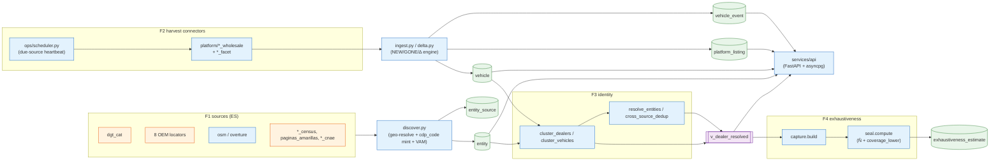
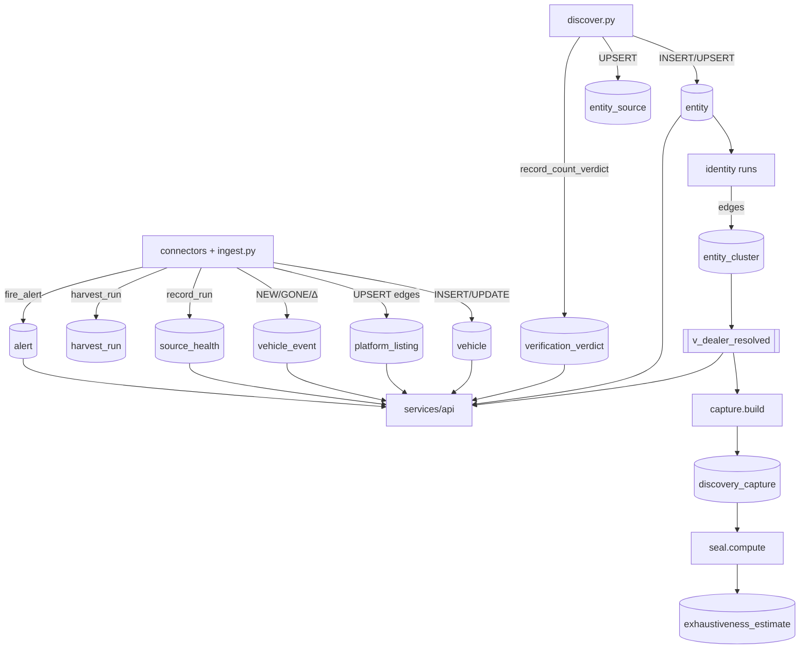

# CARDEEP — SYSTEM A→Z (master end-to-end atom map)

> **What this document is.** The single end-to-end trace of CARDEEP, stage by stage,
> module by module, table by table, verified against the live code and the running DB
> (`postgres://cardeep@localhost:5433/cardeep`, read-only, this session). It is the map a
> future orchestrated agent reads to know *what exists*, *how each piece works*, and
> *where any error comes from*. The pillar docs (00–11) own each subsystem in depth; this
> doc is the spine that connects them and shows the data flowing through.
>
> **Marking discipline.** Every load-bearing fact is `[VERIFIED]` (read from a file or a
> query this session) or `[ASSUMED]` (design judgment, not yet read). No invented paths,
> tables, or fields.
>
> **Replication axis.** Each stage is tagged **CORE** (country-agnostic, replicable to any
> country) or **ES** (Spain-specific: census anchors, INE geo, per-source adapters). The
> Spain→EU→world rollout reuses every CORE box and re-implements only the ES boxes.

---

## 0. The pipeline in one screen

```
  DISCOVER ─────────▶ HARVEST ──────────▶ INGEST/DELTA ────▶ IDENTITY ────▶ EXHAUSTIVENESS ──▶ SERVE
  (census sources     (platform           (NEW/GONE/Δ        (cluster +     (capture-recapture  (FastAPI
   → entities)         connectors          events +          resolve +      → denominator       + asyncpg)
                       → vehicles)          history)          dedup)         + seal)
       │                   │                    │                 │               │                │
   pipeline/           pipeline/            pipeline/         pipeline/      pipeline/         services/
   discover.py +       platform/*_          ingest.py +       identity/*     exhaustiveness/*  api/*
   sources/*           wholesale +          delta.py +
                       ops/scheduler.py     ops/health.py

  entity ◀───────────────────────────────── the spine table everything writes/reads ──────────────────▶
  vehicle ◀── platform_listing (dual membership) ── vehicle_event (append-only history) ───────────────▶
```

`[VERIFIED]` live DB ground truth (queried this session, supersedes the 2026-06-12 floor
in `README.md` — see §11 Drift):

| Fact | Value | Source query |
|---|---|---|
| entities (total) | **419,563** | `count(*) FROM entity` |
| · particular | 339,800 | `GROUP BY kind` |
| · compraventa | 66,549 | |
| · garaje / desguace / concesionario_oficial | 7,900 / 2,785 / 2,299 | |
| · subasta / plataforma / oem_vo_portal / importador / cadena / rent_a_car_vo | 177 / 18 / 14 / 11 / 4 / 6 | |
| · `is_tier1=true` | **14** | `GROUP BY is_tier1` |
| vehicles (available / gone / total) | 2,261,493 / 30,283 / **2,291,776** | `GROUP BY status` |
| vehicle_event rows | **2,499,440** | `count(*) FROM vehicle_event` |
| platform_listing edges | **2,091,082** | `count(*) FROM platform_listing` |
| entity_source links | 435,045 | `count(*) FROM entity_source` |
| distinct resolved dealers (`v_dealer_resolved`) | **397,107** | `count(DISTINCT resolved_ulid)` |
| source_health rows | 56 | `count(*) FROM source_health` |
| harvest_run rows | 387 | `count(*) FROM harvest_run` |
| alert rows | 68 | `count(*) FROM alert` |
| verification_verdict (active: TRUSTWORTHY/REFUTED/UNVERIFIED) | 614 / 58 / 39 | `WHERE superseded_by IS NULL GROUP BY verdict` |
| base tables / views | 44 / 11 | `information_schema` |



---

## 1. STAGE A — DISCOVER (census sources → entities)

**Goal:** find every point-of-sale (the *denominator* candidates), give each one immutable
identity (`cdp_code`), and record which source saw it. → deepens [01-ENTITY-ONTOLOGY](01-ENTITY-ONTOLOGY.md), [03-DATA-MODEL](03-DATA-MODEL.md).

### 1.1 Entry point — `pipeline/discover.py` `[VERIFIED]` **CORE engine, ES adapters**

```
python -m pipeline.discover <source_key>     # e.g. dgt_cat
```

- `ADAPTERS: dict[str, type[SourceAdapter]]` — **25 registered source adapters** `[VERIFIED]`
  (`discover.py:48-74`): `dgt_cat`, 8 OEM (`oem_kia/mg/byd/skoda/dacia/hyundai/mercedes/seat`),
  `osm`, 3 associations (`aedra/acevas/aecs`), 4 `*_census`
  (`autocasion/motor_es/ocasionplus/flexicar`), `overture`, `dork_municipal`,
  `borme_cnae`, `axesor_cnae`, `graph_recursive`, `paginas_amarillas`,
  `autoscout24_census`, `collapse_invisible`.
- `discover(source_key)` flow `[VERIFIED]` (`discover.py:117-167`):
  1. `adapter.fetch()` → `list[DiscoveredEntity]`; `adapter.declared_count()` → the count the
     source itself asserts.
  2. `GeoResolver.load(conn)` (`pipeline/geo.py`) resolves `province_name`/`municipality_name`
     → INE codes; fallbacks: unambiguous city name → `resolve_city_global`; last resort lat/lon
     → `ProvinceGeocoder.nearest_province` (`pipeline/geocode.py`).
  3. `_upsert()` per entity: mint `cdp_code`, `INSERT … ON CONFLICT (cdp_code) DO UPDATE SET
     last_seen=now()`, then upsert `entity_source`. Returns `(was_new, geo_ok, prov_ok)`.
  4. **Honesty gate:** an entity with no resolvable province is **skipped** with a per-entity
     trace (`SKIP no_province`), never minted with a fake code (`discover.py:88-90,144-146`).
  5. **VAM count quorum** (`record_count_verdict`): `paths = {db_ingested, fetched,
     source_declared}` scoped to **this run** (`seen_at >= run_start`) so the quorum is honest
     about per-run ingestion, not cumulative (`discover.py:147-165`).

### 1.2 The source contract — `pipeline/sources/base.py` `[VERIFIED]` **CORE**

`DiscoveredEntity` (dataclass) is the normalized output every adapter yields. Fields:
`kind, source_key, source_ref, legal_name, trade_name, cif, cnae, province_name,
municipality_name, address, postcode, lat, lon, phone, email, website, is_tier1, extra`.
`SourceAdapter` declares `source_key`, `declared_count() -> int|None`, `fetch() -> list`.

> **Replication seam.** `SourceAdapter`/`DiscoveredEntity` are **CORE** — the contract is
> country-agnostic. The 25 adapters in `pipeline/sources/*` are **ES** (DGT Cataluña open
> data, INE province/municipality names, BORME/CNAE Spanish registries, ES OEM dealer
> locators). A new country implements its own adapters against the same contract and the
> rest of the pipeline is unchanged.

### 1.3 Identity mint — `services/api/codes.py` `[VERIFIED]` **CORE algorithm, ES prefix**

`cdp_code(province_code, domain, cif, name, municipality_code, address,
particular_platform, particular_seller_id)` → `CDP-ES-{prov2}-{8×Crockford-base32(sha256(key))}`.
Canonical-key priority (the dedup pre-image, `codes.py:34-70`):
`particular(platform:sellerId)` > **bare** `domain` > `cif` > `name|municipality_code[|address]`
> `name|p{province_code}[|address]`. A *path-bearing* URL (OEM/aggregator portal page) is **not**
identity → falls through to name+address so distinct branches stay distinct (`codes.py:54-60`).
`cdp_pair()` returns `(canonical_key, cdp_code)` so the audit pre-image can be persisted to
`entity.canonical_key` without re-deriving (re-hash-gated). The `CDP-ES-` literal is the only ES
piece; the hash algorithm is CORE.

**Stage A outputs:** rows in **`entity`** (the spine), **`entity_source`** (provenance, N
sources per entity), and a **`verification_verdict`** per discover run.

---

## 2. STAGE B — HARVEST (platform connectors → vehicles)

**Goal:** for each entity/platform, extract ALL its current stock (the *numerator*). → deepens
[00-TIER1-REGISTRY](00-TIER1-REGISTRY.md), [02-SCRAPING-ENGINE](02-SCRAPING-ENGINE.md).

### 2.1 The connector fleet — `pipeline/platform/*` `[VERIFIED]` **CORE engine, ES connectors**

~50 connector modules. Patterns:
- **`*_wholesale`** — drains a whole platform/source (e.g. `coches_net_wholesale`,
  `wallapop_wholesale`, `milanuncios_wholesale`, the `oem_*_wholesale`, the `group_*_wholesale`,
  the `family_*_wholesale`). `[VERIFIED]`
- **`*_facet`** — facet/partition harvesters that break a platform's relevance-pagination cap
  by partitioning (province × price band) and sorting on a STABLE key. `coches_net_facet`
  partitions the gateway's `POST web.gw.coches.net/search` by the 52 provinces (dense ones
  sub-split into 7 price bands) and **imports the wholesale module's cage/parse/DB layer
  wholesale** — it does NOT fork the engine (`coches_net_facet.py` docstring). `[VERIFIED]`
- **`_core/`** — the strangler core that killed 29-way drift:
  - `contract.py` → `PlatformSpec` (frozen dataclass): one platform's identity + data surface.
    `[VERIFIED]`
  - `persistence.py` → the **single** `ensure_platform_entity(conn, spec)` replacing 29
    hand-copies; writes `entity` + `entity_source` + `platform_meta` with an allowlisted,
    injection-safe `ON CONFLICT` refresh set. `[VERIFIED]`
  - `sql.py` → shared bulk statements (`BULK_INSERT_VEHICLES`, `BULK_UPSERT_ENTITY_SOURCE`,
    `BULK_TOUCH_VEHICLES`, `BULK_INSERT_EVENTS`, `BULK_UPSERT_EDGES`) — one source of truth for
    the set-based ingest the connectors share. `[VERIFIED]`

### 2.2 The fetch engine — `pipeline/engine/*` `[VERIFIED]` **CORE**

- `fetch.py` — **Tier-0** = `curl_cffi` with full Chrome TLS/JA3 + HTTP2 impersonation (OPEN
  platforms). **Tier-1** = an opt-in real-browser layer (`engine/tier1/`, camoufox/nodriver) for
  active-defense walls, default `allow_tier1_escalation=False` (gated, may spend).
- `governor.py` — **THE bottleneck, mechanized.** One asyncio token bucket **per registrable
  host**, shared across every concurrent task, with min spacing + jitter. This is the fix for the
  **138-dealer AS24 scar** ("4× parallel workers each polite, aggregate a hammer"). Buckets are
  independent (AS24 throttling never slows Kia). Documented upgrade hook: Redis GCRA for
  multi-process. → [04-ORCHESTRATION §5](04-ORCHESTRATION.md), [06-RESILIENCE-OPS §7](06-RESILIENCE-OPS.md).
- Supporting: `ban_detector.py`, `clearance_cache.py`, `fingerprints.py`, `free_proxies.py`,
  `proxies.py`, `ratelimit_pg.py`, `source_fallback.py`.

### 2.3 The harvest model — `pipeline/sources/autoscout24.py` `[VERIFIED]` **ES (reference recipe)**

`DealerHarvest { dealer: DealerInfo|None, vehicles: list[Vehicle], declared_count: int|None,
pages_drained, raw_count }`. AS24 is the reference open recipe: SSR `__NEXT_DATA__` at
`/profesionales/{slug}` with `numberOfResults` + size-20 pagination, sorted by a STABLE key
(`sort=price&desc=1`) so paginating a live set never fabricates/drops rows across page
boundaries. `RECIPE_VERSION` is stamped on every vehicle and the entity.

### 2.4 The scheduler — `pipeline/ops/scheduler.py` `[VERIFIED]` **CORE**

The single-producer durable heartbeat:
- **APScheduler 3.x `BlockingScheduler` + `SQLAlchemyJobStore` on cardeep-pg** (crash-safe).
- **Single-producer host lock**: a pg advisory lock (`0x43415244`='CARD') refuses a 2nd
  scheduler on the host — the structural guarantee against the AS24 scar (`scheduler.py:802-824`).
- **`heartbeat_tick`** every 15 min: `_due_sources()` queries `source_health` for rows where
  `now() - COALESCE(last_ok,last_fail,'1970…') >= harvest_interval_hours * 1h`, ordered
  most-overdue-first, **skipping sources whose `consecutive_fails >= 3` (open breaker)**. Each due
  source is launched as a **subprocess** (`python -m <module> [args]`), **one at a time**
  (`scheduler.py:296-507`).
- **Registry** (`_build_registry`, `scheduler.py:131-278`): the authoritative `source_key →
  (module, extra_args)` map; multi-source modules disambiguate via `--member/--members/--brand`.
- **The connector writes its own `record_run`**; the scheduler only records a crash when **no new
  `harvest_run` row appeared** vs the pre-launch high-water (`_record_crash_if_unrecorded`,
  idempotency-safe).
- Companion jobs: `silence_watchdog_job` (hourly), `inquisition_cadence_job` (6h),
  `inquisition_prosecute_job` (6h, +30min stagger), `gestionador_detect_job` (24h),
  `canonical_key_backfill_job` (24h).

**Stage B outputs:** **`vehicle`** rows, **`platform_listing`** edges (dual membership),
**`vehicle_event`** NEW rows, **`harvest_run`** audit rows, **`source_health`/`source_breaker`**
updates, **`platform_meta`** for platform entities.

---

## 3. STAGE C — INGEST / DELTA (the live delta engine)

**Goal:** reconcile each harvest against the DB snapshot, emitting the delta the product sells
(NEW / GONE / Δprice / Δphoto / Δkm + complete history). → deepens [03-DATA-MODEL](03-DATA-MODEL.md).

### 3.1 Per-dealer ingest — `pipeline/ingest.py` `[VERIFIED]` **CORE**

`ingest_dealer(conn, geo, harvest, source_key)` (the AS24 path; the bulk connectors do the
set-based equivalent via `_core/sql.py`):
- Guard: province must be a real INE province `01–52`, else skip honestly (`ingest.py:49-50`).
- Upsert the dealer entity (`kind='compraventa', kind_source='platform_label'`) + entity_source.
- Boundary sanitization at ingest (`price_sanity.py`): `sanitize_price/km/year` null impossible
  values; `sanitize_year_km` nulls a jointly-impossible new-car-with-huge-km pair. `normalize_make`
  canonicalizes brand casing / recovers make from the title (`identity/make_normalizer.py`).
- Per vehicle (`ingest.py:77-141`):
  - **NEW** → insert vehicle + `NEW` event.
  - **PRICE_CHANGE / KM_CHANGE / PHOTO_CHANGE** → one **merged** `UPDATE` (changed cols +
    `last_seen`) so exactly one tuple version per changed row + one event per change.
  - Unchanged → only `last_seen=now()` (never a no-op UPDATE of unmutated data).
- **GONE guard (B2.3)** `[VERIFIED]` (`ingest.py:143-185`, `delta_guard.should_emit_gone`): the
  GONE sweep fires **only when `harvested >= declared * 0.95`**. A partial drain (timeout at page
  N of M) **suppresses** the sweep and **fires an alert** instead — preventing false GONEs from a
  truncated crawl. A satisfied guard auto-resolves the prior `gone_guard` alert.
- Closes with a VAM verdict: `{db_available, harvested, source_declared}`.

### 3.2 Source-wide GONE reconcile — `pipeline/delta.py::reconcile_gone` `[VERIFIED]` **CORE**

Called by `record_run` after a successful coverage-instrumented harvest
(`ops/health.py:280-284`). Retires vehicles a source owns that were **not re-seen since the
harvest-start boundary** — but ONLY if the B9 coverage gate confirms a ~complete harvest
(`coverage_pct >= 0.9`, verdict not REFUTED) and the gone fraction is plausible (>50% cap). It is
the **single GONE-event emitter** for the bulk path. On the first run (`prior_last_ok IS NULL`) it
is skipped (nothing to compare against).

**Stage C outputs:** mutated **`vehicle`** rows + a complete **`vehicle_event`** stream
(`NEW/GONE/PRICE_CHANGE/KM_CHANGE/PHOTO_CHANGE`) = the live delta + history.

---

## 4. STAGE D — IDENTITY / RESOLUTION (one code per real dealer)

**Goal:** collapse the same real dealer seen by N sources into one served identity, without
ever merging two distinct dealers. → **authority doc** [11-IDENTITY-RESOLUTION-AUTHORITY](11-IDENTITY-RESOLUTION-AUTHORITY.md); deepens [01-ENTITY-ONTOLOGY](01-ENTITY-ONTOLOGY.md).

### 4.1 The served resolver — `v_dealer_resolved` `[VERIFIED]`

The **authoritative** dealer-identity resolver consumed by `resolve_cluster`
(`services/api/deps.py`) and every entity/inventory endpoint. It composes two VAM-verified layers
(`11-IDENTITY-RESOLUTION-AUTHORITY.md`):
```
entity → B1 (v_canonical, run 'dealer-identity-det-v1', vam_verified=TRUE)
       → canonical_dedup (run 'canonical-dedup-deeplink-v1', deep-link-backed, vam_verified=TRUE)
       → resolved_cdp_code (the super-canonical)
```
Live: **397,107 distinct `resolved_ulid`** `[VERIFIED]`. `resolve_cluster` (`deps.py:73-122`)
returns the full cluster membership for any requested `cdp_code` via the `COALESCE(resolved_ulid,
entity_ulid)` logic — so a requested code serves its whole cluster's stock.

### 4.2 B1 — deterministic dealer clustering — `pipeline/identity/cluster_dealers.py` `[VERIFIED]` **CORE engine, ES tuning**

Fully deterministic union-find (run `dealer-identity-det-v1`, **vam_verified=TRUE**). Four edge
types, all reproducible from DB state:
1. `normalized_name + municipality_code` (exact; legal-suffix stripped — FIX-B).
2. `phone_digits + municipality_code` (≥7 digits).
3. `normalized_website_host + municipality_code` (same-muni guard against chain collapse).
4. SQL `levenshtein(normalized_name) ≤ 2` within the same muni, only in blocks ≤ 500 entities
   (`FUZZY_BLOCK_CAP`) and names ≥ 8 chars (`FUZZY_MIN_NAME_LEN`, FIX-A against `megar`/`vegar`).

Canonical pick: `source_group rank → richness → first_seen → cdp_code`. Writes
`entity_cluster_run` + `entity_cluster`. Live run: **n_in 61,551 → 42,259 clusters, 19,292
merged, vam_verified=TRUE** `[VERIFIED]`. Self-verifies with 7 Director checks (recall, precision,
chain-separation for Flexicar/OcasionPlus, MOBILITY CENTRO collapse, FIX-A/B). The legal-suffix
list and chain names are ES-tuned; the union-find machinery is CORE.

### 4.3 β — inventory-fingerprint resolution — `pipeline/identity/resolve_entities.py` `[VERIFIED]` **CORE**

Run `entity-resolution-fingerprint-v1` (**computed, sealed, NOT served** — deferred per the
authority doc). Derives "same dealer across channels" using **Jaccard on the B7 vehicle-cluster
canonical sets** (`JACCARD_THETA=0.30`) as the dominant key, reinforced by phone/website.
Anti-over-merge guards: catalog canonicals excluded (`km=0` or `entity_count ≥ 5`); centralita
phones (`≥3` entities) require fingerprint corroboration; cross-province needs fingerprint;
**chain guard** (same `org_id` never merges); **INE-validated city-name guard**. Uses a
`ConstrainedUnionFind` that propagates city/org constraints transitively (the A—C—B bridge bug
fix). Seeds B1 edges (B1∘β composition). → why it is deferred: [11-IDENTITY-RESOLUTION-AUTHORITY](11-IDENTITY-RESOLUTION-AUTHORITY.md).

### 4.4 Cross-source dedup — `pipeline/identity/cross_source_dedup.py` `[VERIFIED]` **CORE**

Run `cross-source-dedup-v1` (**vam_verified=FALSE**, NOT served). Bridges OSM↔digital platforms
(which carry no lat/lon) by orthogonal signals: phone (validated ES 9-digit key via
`phone_es.phone_match_key`), website domain, exact normalized name (len ≥ 6, chains excluded).
Orthogonality guard: `GEO_SOURCES × DIGITAL_SOURCES` required; same muni required. Live run: n_in
50,497 → 49,809 clusters, **688 merges, vam_verified=FALSE** `[VERIFIED]`. Deferred because its
edges connect distinct B1 super-canonicals → serving needs a union-find rebuild of the core view
for only ~13 genuine dealers (risk ≫ value, per the authority doc).

### 4.5 Vehicle clustering — `pipeline/identity/cluster_vehicles.py` `[VERIFIED]` **CORE**

Run `vehicle-identity-det-v1` — clusters the **same physical car** across listings/platforms
(the canonical_vehicle that β fingerprints on and that `/inventory` dedups by). The dual-membership
model (`platform_listing`, **2,091,082 edges** live) lets one car belong to a dealer AND ≥1
platforms.

> **Replication seam.** The clustering *algorithms* (union-find, Jaccard, constrained UF,
> canonical selection) are all **CORE**. What is **ES** is the tuning: the legal-suffix list, the
> chain-name patterns, the validated-phone format (`phone_es`), and the INE municipality set the
> city-guard validates against (`geo_municipality.name`).

---

## 5. STAGE E — EXHAUSTIVENESS / SEAL (the measured denominator)

**Goal:** turn "we found N" into "N is X% ± CI of the *true* total" via capture-recapture, and
SEAL a stratum only when its conservative coverage clears the threshold. → deepens
[05-VERIFICATION-VAM §6](05-VERIFICATION-VAM.md), [10-VERIFICATION-STACK](10-VERIFICATION-STACK.md), and `verification/V1-DENOMINATOR-PROOF.md`.

### 5.1 Capture matrix — `pipeline/exhaustiveness/capture.py` `[VERIFIED]` **CORE engine, ES strata**

`build(build_run_id, unit='resolved')` populates **`discovery_capture`**. The **capture unit is
the resolved (deduped) entity** (`v_dealer_resolved.resolved_ulid`) — so a dealer seen in OSM and
autocasion collapses to ONE capture row per orthogonal list (the fix for the old undercounted
overlap). Each unit gets a 0/1 presence vector over the orthogonal lists; strata are
`province_code × segment` (4 broad dealer segments, ~52×4). `read_patterns()` returns the
per-stratum frequency of each capture pattern (the all-zero cell is what MSE estimates).

### 5.2 Seal — `pipeline/exhaustiveness/seal.py` `[VERIFIED]` **CORE**

`compute(build_run_id, threshold=0.95)`:
- Per stratum: `estimators.estimate_stratum(freqs)` → `Estimate{n_obs, n_hat, ci_low, ci_high,
  coverage_lower, identified, method}`. Optional R cross-check (Rcapture/LCMCR) when K≥3
  (`estimators_r.py`). Optional external-census triangulation (`triangulation.py`, CNAE-451/DIRCE
  anchors).
- **Seal criterion (anti-maquillaje):** a stratum is SEALED iff `identified AND coverage_lower
  (= n_obs/ci_high) >= threshold`. The point estimate **never** certifies (`seal.py:39-47`).
- **National roll-up = SUM of per-stratum N̂ over *identified* strata only**; unidentified strata
  are reported separately as observed-but-uncertified (NOT folded in as "100% covered"). A pooled
  national fit is computed only as an explicitly-unreliable cross-check.
- Persists to **`exhaustiveness_estimate`** (per-stratum + a national `province_code/segment=NULL`
  row).

Live national estimate `[VERIFIED]` (latest build, `exhaustiveness_estimate`): n_obs 1,761, N̂
≈ 2,417, **coverage_lower 0.552, sealed=FALSE** (the dealer-strata build; an earlier build at
n_obs 26,743 shows coverage_lower 0.728). The denominator is **measured, not sealed** — exactly
the "confess the gap" doctrine.

Runner: `python -m pipeline.exhaustiveness.cli run [--threshold 0.95] [--unit resolved|splink]
[--r-crosscheck]` (`exhaustiveness/cli.py`).

> **Replication seam.** Chapman/log-linear MSE, the stratified roll-up, and the
> conservative-coverage seal rule are **CORE**. The strata definition (Spanish provinces × dealer
> segments) and the external anchors (DIRCE/CNAE-451) are **ES**.

---

## 6. STAGE F — SERVE (the live API)

**Goal:** serve the sealed product surface (entity / inventory / delta / geo / platform / ops)
behind a consistent envelope. → deepens [03-DATA-MODEL §7](03-DATA-MODEL.md), [06-RESILIENCE-OPS](06-RESILIENCE-OPS.md).

### 6.1 App — `services/api/main.py` `[VERIFIED]` **CORE**

FastAPI + asyncpg pool (lifespan, `min 1 / max 8`). Envelope `{ok, data, error, meta}`
(`deps.ok/err`). Middleware: slowapi rate-limit (120/min default, 30/min expensive), CORS,
TTLCache response cache. API-key auth via `require_api_key` when `CARDEEP_API_KEY` is set;
`/health` is always public.
Run: `uvicorn services.api.main:app --host 127.0.0.1 --port 8090`.

### 6.2 Routers — `services/api/routers/*` `[VERIFIED]`

| Router | Surface (representative) |
|---|---|
| `entities.py` | `/entities/{cdp}`, `/entities/{cdp}/inventory` (cluster-aware, dedups WITHIN the dealer cluster by `canonical_vehicle_ulid`), `/delta` (events from ALL cluster members) |
| `geo.py` | `/geo` province/comarca/municipality tree; `/geo/{prov}/municipalities/{muni}/entities` — serves only `status='active' AND kind <> 'particular'` (the curated map) |
| `platforms.py` | `/platforms/{cdp}`, `/platforms/{cdp}/inventory` |
| `vehicles.py` | `/vehicles/{ulid}` (resolves alias → canonical), `/vehicles/{ulid}/history` |
| `ops.py` | `/health` (liveness, public), `/stats` (authed — coverage scale is a competitive signal), `/alerts`, `/sources` |

The per-dealer `/inventory` deliberately does **not** apply the entity-status filter (a directly
requested dealer's full stock is served regardless of verification status — "sacarle TODO su
stock"); `/geo` is the curated active-only map. The divergence is intentional (`main.py` docstring).

Serving views `[VERIFIED]`: `servable_entity`, `servable_vehicle`, `v_dealer_resolved`,
`v_canonical`, `v_canonical_vehicle` (+ `v_canonical_deduped_draft`).

> **Replication seam.** The whole API tier is **CORE** — endpoints, envelope, cluster-aware
> serving, caching, auth. Nothing in `services/api/` is Spain-specific except the `CDP-ES-` codes
> flowing through it.

---

## 7. The cross-cutting spine: tables every stage touches

| Table | Written by | Read by | Role |
|---|---|---|---|
| **entity** | discover, ingest, `ensure_platform_entity` | identity, exhaustiveness, API | the POS spine (419,563 rows) |
| **entity_source** | discover, ingest, connectors | identity, capture | provenance (N sources/entity; 435,045 rows) |
| **vehicle** | ingest, connectors | identity, API | stock (2,291,776 rows) |
| **platform_listing** | connectors (`BULK_UPSERT_EDGES`) | API | dual membership (2,091,082 edges) |
| **vehicle_event** | ingest, `reconcile_gone`, connectors | API `/delta` `/history` | append-only delta+history (2,499,440 rows) |
| **verification_verdict** | `record_count_verdict` | evict, inquisition, API | VAM quorum ledger (614 TRUSTWORTHY active) |
| **source_health / source_breaker** | `record_run` | scheduler, `is_open`, API `/sources` | watchdog + circuit breaker (56 rows) |
| **harvest_run** | connectors, scheduler crash-net | scheduler high-water | run audit (387 rows) |
| **alert** | `fire_alert`, ingest gone-guard | API `/alerts`, watchdog | exact-origin alerting (68 rows) |
| **entity_cluster(_run) / entity_resolution(_run)** | identity runs | `v_dealer_resolved`, capture | resolution edges |
| **discovery_capture / exhaustiveness_estimate** | capture, seal | seal, reporting | denominator measurement |
| **platform_meta** | `ensure_platform_entity` | API | platform data-surface (43 rows) |



---

## 8. Where every error comes from (the debugging map)

The mandate "a source fails → alert with the EXACT origin → self-repairs → never falls" is
mechanized; this is the table that lets an agent localize any fault:

| Symptom | Exact origin / signal | Module | What it means |
|---|---|---|---|
| entity dropped at discover | stdout `SKIP no_province: …` | `discover.py:144` | no resolvable INE province — never minted with a fake code |
| discover quorum failed | `verification_verdict` REFUTED/UNVERIFIED, `subject_type='source'` | `verify.py` | db_ingested ≠ fetched ≠ declared |
| harvest blocked / banned | `alert.origin = '<src>:scrape'`, `repair_attempt.action` | `ops/health.py::auto_repair` + `classify_failure` | 403/429/drift typed → refingerprint / quarantine / re_receta / escalate_owner |
| false GONE prevented | `alert.origin = 'as24:gone_guard:<cdp>'` | `ingest.py:170` / `delta_guard` | partial drain (<95% declared) suppressed the sweep |
| source went silent | hourly alert (>2× interval) | `ops/silence_watchdog.py` via scheduler | no `record_run` — S-HEALTH blind-spot caught |
| circuit breaker open | scheduler `skip <src> — breaker open` | `scheduler._due_sources` + `is_open` | `consecutive_fails ≥ 3`, cooling down |
| host throttling (the AS24 scar) | governor token bucket per host | `engine/governor.py` | aggregate rate capped regardless of worker count |
| denominator not sealed | `exhaustiveness_estimate.sealed=FALSE`, `coverage_lower < threshold` | `seal.py` | honest gap — NOT served as 100% |
| two dealers merged / split wrong | `entity_cluster` checks 1–7 output; `v_dealer_resolved` | `cluster_dealers.py` | recall/precision/chain-separation self-tests |

---

## 9. CORE vs ES summary (the replication ledger)

| Layer | CORE (replicable as-is) | ES (re-implement per country) |
|---|---|---|
| Discover | `discover.py` engine, `SourceAdapter`/`DiscoveredEntity` contract, `cdp_code` hash algorithm | the 25 `sources/*` adapters, `CDP-ES-` prefix, INE geo, BORME/CNAE/DGT anchors |
| Harvest | `engine/*` (fetch tiers, governor), `platform/_core/*`, scheduler, delta/GONE-guard | the ~50 `platform/*` connectors, the `*_facet` partition plans, per-platform recipes |
| Identity | union-find, Jaccard, constrained UF, canonical selection, `v_dealer_resolved` composition | legal-suffix list, chain patterns, `phone_es`, the INE municipality set |
| Exhaustiveness | MSE estimators, stratified roll-up, conservative seal rule | province×segment strata, DIRCE/CNAE external anchors |
| Serve | the entire `services/api/` tier | nothing (only `CDP-ES-` codes pass through) |
| Verify | `record_count_verdict` quorum, deep-ledger CHECK, S-HEALTH, Inquisition | nothing structural |

The Spain→EU→world path: **keep every CORE box, swap every ES box.** A new country = N source
adapters + M platform connectors + a geo backbone + tuning constants, plugged into the unchanged
engine/identity/exhaustiveness/serve/verify core.

---

## 10. Cross-links (the rest of the corpus)

- [README](README.md) — the system on one screen, the nine pillars, the permanent S-* systems.
- [00-TIER1-REGISTRY](00-TIER1-REGISTRY.md) — what to attack and in what order (platforms + walls).
- [01-ENTITY-ONTOLOGY](01-ENTITY-ONTOLOGY.md) — the 11 entity kinds, platform-as-entity, cdp_code model.
- [02-SCRAPING-ENGINE](02-SCRAPING-ENGINE.md) — the tiered fetch engine + recipe system (Stage B depth).
- [03-DATA-MODEL](03-DATA-MODEL.md) — the PostgreSQL schema every stage writes (the table contracts).
- [04-ORCHESTRATION](04-ORCHESTRATION.md) — the control plane: governor, scheduler, cost-router (Stage B/C depth).
- [05-VERIFICATION-VAM](05-VERIFICATION-VAM.md) + [10-VERIFICATION-STACK](10-VERIFICATION-STACK.md) — VAM → deep ledger → gestionador → Inquisition.
- [06-RESILIENCE-OPS](06-RESILIENCE-OPS.md) — watchdog, exact-origin alerting, auto-repair ladder (Stage 8 depth).
- [07-COVERAGE-STRATEGY](07-COVERAGE-STRATEGY.md) — the A-to-Z run order to 100% (denominator-first).
- [08-REPO-ORGANIZATION](08-REPO-ORGANIZATION.md) — the on-disk tree + the Tier-1/long-tail separation.
- [11-IDENTITY-RESOLUTION-AUTHORITY](11-IDENTITY-RESOLUTION-AUTHORITY.md) — the served resolver + deferred compositions (Stage D authority).

---

## 11. Drift & gaps found (this session, against live code/DB)

- **`README.md` §7 "Live ground truth" is STALE.** It states ~12,862 entities / ~39,068 vehicles
  / 262 recipes / **0 `is_tier1` / 0 platform entities** as of 2026-06-12. Live DB this session:
  **419,563 entities / 2,291,776 vehicles / 14 `is_tier1` / 18 `plataforma` + 14 `oem_vo_portal`
  entities / 43 `platform_meta` rows** `[VERIFIED]`. The README's floor predates the platform
  harvest fleet and the particular census. (Owned by the README/overview agent — flagged, not
  edited here.)
- **`README.md` S-* table understates maturity.** S-HEALTH is shown "⏳ tables live, nothing writes
  them yet" but `source_health` has **56 rows**, `harvest_run` **387**, `alert` **68** — the
  watchdog/breaker IS live (`ops/health.py` is wired into every connector via `record_run`).
- **`pipeline/sources/base.py` `DiscoveredEntity.kind` docstring lists 6 kinds**
  (`concesionario_oficial|compraventa|garaje|desguace|plataforma|cadena`) but the DB carries **11
  kinds** (adds `particular`, `subasta`, `oem_vo_portal`, `importador`, `rent_a_car_vo`). The
  comment is a stale enumeration, not the live ontology (owned by the ontology agent — flagged).
- **Denominator is measured but NOT sealed** (`coverage_lower 0.552–0.728 < 0.95`). This is the
  honest, doctrine-correct state ("confess the gap"), not a bug — but any agent reading "100%
  mandate" must know the seal is open. → [07-COVERAGE-STRATEGY](07-COVERAGE-STRATEGY.md).
- **β and cross-source-dedup runs exist but are intentionally NOT served** (vam_verified=FALSE /
  deferred) per [11-IDENTITY-RESOLUTION-AUTHORITY](11-IDENTITY-RESOLUTION-AUTHORITY.md). An agent
  must not wire `v_resolved_dealer` (β-only, 0 consumers) into any serving path; the served
  resolver is `v_dealer_resolved`.
